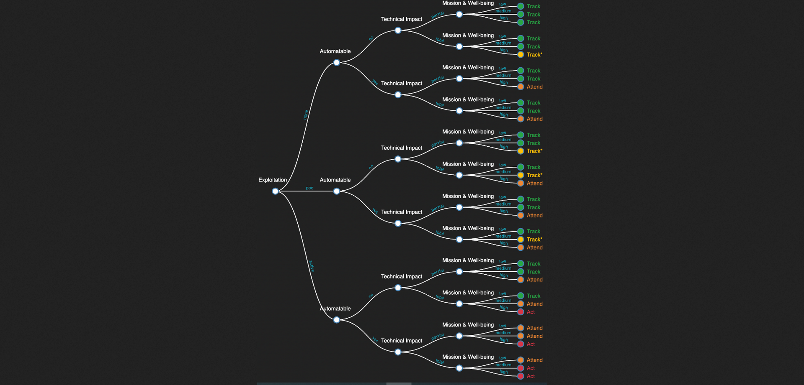
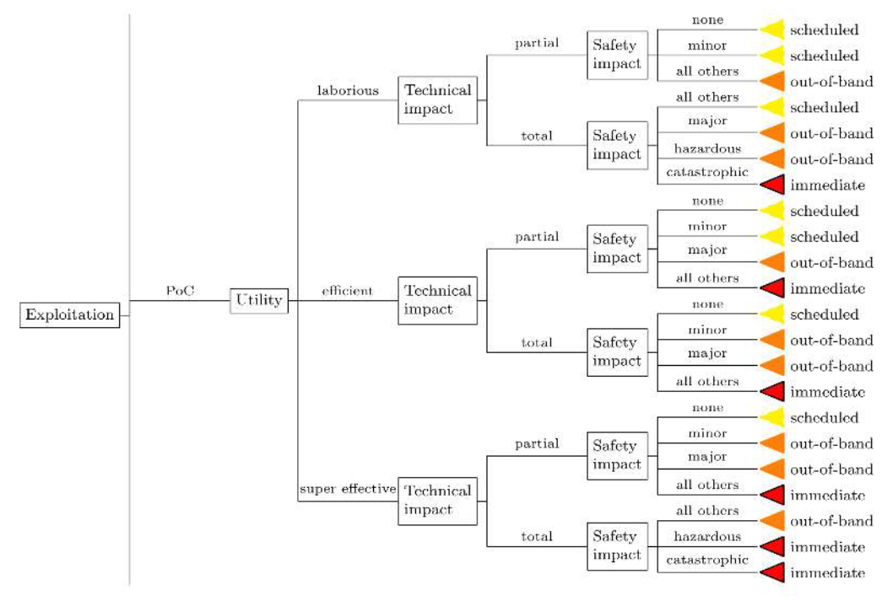

# TypeScript implementation of SSVC (Stakeholder-Specific Vulnerability Categorization)


[](https://www.npmjs.com/package/ssvc)
[](https://github.com/trivialsec/typescript-ssvc/blob/master/LICENSE)
[](https://www.npmjs.com/package/ssvc)
[](https://www.npmjs.com/package/ssvc)

A prioritization framework to triage CVE vulnerabilities as an alternative or compliment to CVSS.

This library provides a comprehensive solution to using the SSVC framework with both CISA and FIRST methodologies. It includes examples of high, medium, and low severity decision prioritizations for each methodology.

## Installation

```sh
npm install ssvc
```

## Decision Trees

### CISA



### FIRST



## Decision Class Usage Guide

The `Decision` class is used to evaluate cybersecurity decisions based on different methodologies. This guide demonstrates how to use the class with both CISA and FIRST methodologies.

### Importing the Necessary Components

First, import the required classes and enums:

```javascript
import { 
  Decision, 
  Exploitation, 
  Automatable, 
  Utility,
  TechnicalImpact, 
  MissionWellbeingImpact,
  SafetyImpact, 
  Methodology 
} from './decision';
```

### CISA Methodology Examples

#### Example 1: High Severity Case

```javascript
const cisaHigh = new Decision(
  Exploitation.ACTIVE,
  Automatable.YES,
  undefined,
  TechnicalImpact.TOTAL,
  undefined,
  MissionWellbeingImpact.HIGH,
  Methodology.CISA
);
console.log(cisaHigh.evaluate());
// Expected output: OutcomeCISA { action: 'Act', priority: 'immediate' }
```

#### Example 2: Medium Severity Case

```javascript
const cisaMedium = new Decision(
  Exploitation.POC,
  Automatable.NO,
  undefined,
  TechnicalImpact.PARTIAL,
  undefined,
  MissionWellbeingImpact.MEDIUM,
  Methodology.CISA
);
console.log(cisaMedium.evaluate());
// Expected output: OutcomeCISA { action: 'Track*', priority: 'medium' }
```

#### Example 3: Low Severity Case

```javascript
const cisaLow = new Decision(
  Exploitation.NONE,
  Automatable.NO,
  undefined,
  TechnicalImpact.PARTIAL,
  undefined,
  MissionWellbeingImpact.LOW,
  Methodology.CISA
);
console.log(cisaLow.evaluate());
// Expected output: OutcomeCISA { action: 'Track', priority: 'low' }
```

### FIRST Methodology Examples

#### Example 1: High Severity Case

```javascript
const firstHigh = new Decision(
  Exploitation.ACTIVE,
  undefined,
  Utility.SUPER_EFFECTIVE,
  TechnicalImpact.TOTAL,
  SafetyImpact.CATASTROPHIC,
  undefined,
  Methodology.FIRST
);
console.log(firstHigh.evaluate());
// Expected output: OutcomeFIRST { action: 'immediate', priority: 'immediate' }
```

#### Example 2: Medium Severity Case

```javascript
const firstMedium = new Decision(
  Exploitation.POC,
  undefined,
  Utility.EFFICIENT,
  TechnicalImpact.PARTIAL,
  SafetyImpact.MAJOR,
  undefined,
  Methodology.FIRST
);
console.log(firstMedium.evaluate());
// Expected output: OutcomeFIRST { action: 'out-of-band', priority: 'medium' }
```

#### Example 3: Low Severity Case

```javascript
const firstLow = new Decision(
  Exploitation.NONE,
  undefined,
  Utility.LABORIOUS,
  TechnicalImpact.PARTIAL,
  SafetyImpact.MINOR,
  undefined,
  Methodology.FIRST
);
console.log(firstLow.evaluate());
// Expected output: OutcomeFIRST { action: 'scheduled', priority: 'low' }
```

### Using String Inputs

The `Decision` constructor also accepts string inputs for enum values:

```javascript
const cisaStringInputs = new Decision(
  'active',
  'yes',
  undefined,
  'total',
  undefined,
  'high',
  'CISA'
);
console.log(cisaStringInputs.evaluate());
// Expected output: OutcomeCISA { action: 'Act', priority: 'immediate' }

const firstStringInputs = new Decision(
  'poc',
  undefined,
  'efficient',
  'partial',
  'major',
  undefined,
  'FIRST'
);
console.log(firstStringInputs.evaluate());
// Expected output: OutcomeFIRST { action: 'out-of-band', priority: 'medium' }
```

### Error Handling

The `Decision` class will throw errors if required fields are missing or invalid:

```javascript
try {
  const invalidDecision = new Decision(
    undefined,
    Automatable.YES,
    undefined,
    TechnicalImpact.TOTAL,
    undefined,
    MissionWellbeingImpact.HIGH,
    Methodology.CISA
  );
  invalidDecision.evaluate();
} catch (error) {
  console.error(error.message);
  // Expected output: "Exploitation must be a valid Exploitation enum value"
}
```
