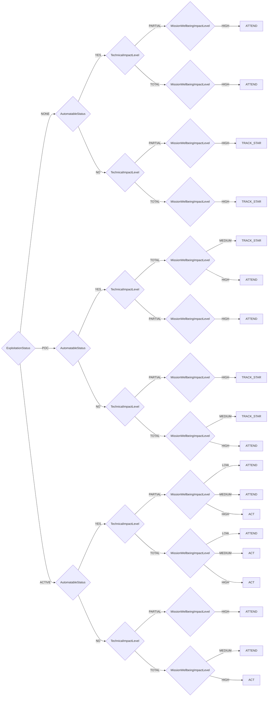

# TypeScript implementation of SSVC (Stakeholder-Specific Vulnerability Categorization)

[](https://www.npmjs.com/package/ssvc)
[](https://github.com/trivialsec/typescript-ssvc/blob/master/LICENSE)
[](https://www.npmjs.com/package/ssvc)

[](https://www.npmjs.com/package/ssvc)

A prioritization framework to triage CVE vulnerabilities as an alternative or compliment to CVSS.

## 🤖 NEW: AI/LLM Methodology Available

We've added a new **AI/LLM Triage** methodology specifically designed for assessing AI and LLM vulnerabilities. This methodology addresses the unique security considerations of AI systems including model security, data poisoning, prompt injection, and AI-specific attack vectors.

**Features:**
- **AI-specific decision points**: Model access, data poisoning potential, and AI system impact assessment
- **Comprehensive coverage**: Addresses both traditional software vulnerabilities in AI systems and AI-specific threats
- **Aligned with AI security frameworks**: Follows emerging best practices for AI security assessment

See the [AI/LLM Triage Documentation](docs/ai_llm_triage.md) for detailed usage and examples.

## 🏗️ Schema-Driven Architecture

This library implements a **standardized YAML schema** for SSVC methodologies, staying true to SSVC's core design principle of being **"Stakeholder-Specific"** while enabling **interoperability** and **portability**:

- **🔧 Flexibility**: Create custom methodologies tailored to your organization's needs
- **🔗 Interoperability**: Schema-compliant YAML works across different SSVC tools
- **📦 Portability**: Take your configurations with you - no vendor lock-in
- **✅ Validation**: Built-in schema validation ensures consistency and correctness

```bash
# Validate your YAML methodologies against the schema
just validate-methodologies
# or
npx ts-node scripts/validate-methodologies.ts
```

See the [**Schema Documentation**](docs/methodology-schema.md) for complete details on creating schema-compliant YAML methodologies.

This library features a **plugin-based architecture** that allows for easy integration of different SSVC methodologies. It includes built-in support for **6 methodologies**:

| Methodology | Description | Documentation | Official Source |
|-------------|-------------|---------------|-----------------|
| **AI LLM Triage** | AI-specific vulnerability triage for LLMs | [docs/ai_llm_triage.md](docs/ai_llm_triage.md) | [NIST AI Risk Management](https://www.nist.gov/ai-risk-management) |
| **CISA** | CISA Stakeholder-Specific Vulnerability Categorization | [docs/cisa.md](docs/cisa.md) | [CISA SSVC Guide](https://www.cisa.gov/stakeholder-specific-vulnerability-categorization-ssvc) |
| **Coordinator Triage** | CERT/CC Coordinator Triage Decision Model | [docs/coordinator_triage.md](docs/coordinator_triage.md) | [CERT/CC Coordinator Triage](https://certcc.github.io/SSVC/howto/coordination_triage_decision/) |
| **Coordinator Publication** | CERT/CC Coordinator Publication Decision Model | [docs/coordinator_publication.md](docs/coordinator_publication.md) | [CERT/CC Publication Decision](https://certcc.github.io/SSVC/howto/publication_decision/) |
| **Supplier** | CERT/CC Supplier Decision Model for patch prioritization | [docs/supplier.md](docs/supplier.md) | [CERT/CC Supplier Tree](https://certcc.github.io/SSVC/howto/supplier_tree/) |
| **Deployer** | CERT/CC Deployer Decision Model for patch deployment | [docs/deployer.md](docs/deployer.md) | [CERT/CC Deployer Tree](https://certcc.github.io/SSVC/howto/deployer_tree/) |

All methodologies support both **quantitative** (structured decision trees) and **qualitative** (expert judgment) approaches, with the library providing the quantitative framework while allowing for qualitative override based on domain expertise.

#### Other Languages

Check out the [](https://pypi.org/project/ssvc/) Python implementation of SSVC

> Golang is currently in development

## Installation

```sh
npm install ssvc
```

## Quick Start

### Basic Example - CISA Methodology

```javascript
import { createDecision, listMethodologies } from 'ssvc';

// See available methodologies
console.log(listMethodologies()); 
// ['CISA', 'AI/LLM Triage', 'Coordinator Triage', 'Coordinator Publication', 'Supplier', 'Deployer']

// Critical vulnerability requiring immediate action
const criticalDecision = createDecision('CISA', {
  exploitation: 'active',      // Active exploitation detected
  automatable: 'yes',          // Can be automated
  technical_impact: 'total',   // Complete system compromise possible
  mission_wellbeing: 'high'    // High impact on mission/business
});

const result = criticalDecision.evaluate();
console.log(result); // { action: 'act', priority: 'immediate' }

// Lower priority vulnerability for comparison
const lowPriorityDecision = createDecision('CISA', {
  exploitation: 'none',        // No known exploitation
  automatable: 'no',           // Manual exploitation required
  technical_impact: 'partial', // Limited impact
  mission_wellbeing: 'low'     // Minimal business impact
});

const lowResult = lowPriorityDecision.evaluate();
console.log(lowResult); // { action: 'track', priority: 'low' }
```

### AI/LLM Security Example

```javascript
// AI-specific vulnerability assessment
const aiVulnDecision = createDecision('AI/LLM Triage', {
  model_access: 'direct',               // Direct model access possible
  data_poisoning: 'confirmed',          // Training data compromised
  ai_system_impact: 'full_compromise',  // Complete AI system compromise
  traditional_exploit: 'yes'            // Also exploitable via traditional methods
});

const aiResult = aiVulnDecision.evaluate();
console.log(aiResult); // { action: 'act', priority: 'immediate' }
```

## 📋 Schema Validation System

The schema validation system ensures all SSVC methodologies follow a consistent hierarchical tree structure while preserving the flexibility that makes SSVC "Stakeholder-Specific":

### Why Schema Standardization Matters

**SSVC's Design Philosophy**: The name "Stakeholder-Specific Vulnerability Categorization" explicitly recognizes that different organizations have different priorities, risk tolerances, and operational contexts. However, this flexibility should not come at the cost of interoperability.

**Benefits of Schema Compliance**:

1. **🎯 True to SSVC's Intent**: Enables stakeholder-specific customization within a consistent framework
2. **🔄 Tool Interoperability**: Your YAML configurations work across different SSVC implementations
3. **📊 Data Portability**: Move between tools without vendor lock-in or configuration migration
4. **✅ Quality Assurance**: Validation catches structural errors before deployment
5. **📚 Documentation**: Standardized structure enables automatic documentation generation
6. **🔧 Extensibility**: Add new methodologies following established patterns

### Schema Validation in Action

```bash
# Validate all methodologies
just validate-methodologies

# Output example:
🔍 Validating SSVC Methodology Files...

Validating cisa.yaml...
✅ cisa.yaml is valid

Validating custom-methodology.yaml...
❌ custom-methodology.yaml has errors:
   • Inconsistent tree depth: found depths 3, 4. All paths should have the same depth.
   • Action 'REVIEW' has no priority mapping
```

### Schema Requirements

All YAML methodologies must follow these structural requirements:

- **Hierarchical Decision Trees**: Nested tree structure (not flat arrays)  
- **Consistent Depth**: All decision paths must have identical depth
- **Complete Mappings**: All actions must have priority mappings
- **Enum Validation**: All declared enums must be used, all used enums must be declared

See [**Schema Documentation**](docs/methodology-schema.md) for detailed requirements and examples.

## Plugin-Based Architecture

The library supports a flexible plugin system where each methodology is a separate plugin. This allows for:

- **Easy extensibility** - Add new methodologies by creating schema-compliant YAML configurations
- **Clean separation** - Each methodology is self-contained
- **Type safety** - Full TypeScript support with generated types
- **Documentation generation** - Automatic mermaid diagrams and markdown docs

## Built-in Methodologies

### CISA Methodology

The CISA Stakeholder-Specific Vulnerability Categorization framework:

```javascript
import { createDecision } from 'ssvc';

const cisaDecision = createDecision('CISA', {
  exploitation: 'active',      // 'none' | 'poc' | 'active'
  automatable: 'yes',          // 'yes' | 'no'  
  technical_impact: 'total',   // 'partial' | 'total'
  mission_wellbeing: 'high'    // 'low' | 'medium' | 'high'
});

const outcome = cisaDecision.evaluate();
// Returns: { action: 'act', priority: 'immediate' }
```

**Possible Actions:**
- `track` → Low priority
- `track*` → Medium priority  
- `attend` → Medium priority
- `act` → Immediate priority

### AI/LLM Triage Methodology

The AI/LLM Triage methodology addresses the unique security considerations of AI systems, including model vulnerabilities, data poisoning, prompt injection, and AI-specific attack vectors:

```javascript
import { createDecision } from 'ssvc';

const aiDecision = createDecision('AI/LLM Triage', {
  model_access: 'api',                    // 'none' | 'local' | 'api' | 'direct'
  data_poisoning: 'confirmed',            // 'none' | 'suspected' | 'confirmed'
  ai_system_impact: 'full_compromise',    // 'minimal' | 'degraded' | 'full_compromise'
  traditional_exploit: 'yes'              // 'yes' | 'no'
});

const outcome = aiDecision.evaluate();
// Returns: { action: 'act', priority: 'immediate' }
```

**Possible Actions:**
- `track` → Low priority
- `monitor` → Medium priority
- `investigate` → High priority
- `act` → Immediate priority

**AI-Specific Considerations:**
- **Model Security**: Direct access to model weights, training data, or inference logic
- **Data Poisoning**: Malicious training data affecting model behavior
- **AI System Impact**: Range from performance degradation to complete system compromise
- **Traditional Exploits**: Whether the vulnerability can be exploited through conventional software attack vectors

### Coordinator Triage Methodology

The CERT/CC Coordinator Triage Decision Model for vulnerability coordinators:

```javascript
import { createDecision } from 'ssvc';

const coordinatorDecision = createDecision('Coordinator Triage', {
  report_public: 'yes',              // 'yes' | 'no'
  supplier_contacted: 'yes',         // 'yes' | 'no'
  report_credibility: 'credible',    // 'credible' | 'not_credible'
  supplier_cardinality: 'multiple',  // 'one' | 'multiple'
  utility: 'super_effective',        // 'laborious' | 'efficient' | 'super_effective'
  public_safety_impact: 'significant' // 'minimal' | 'significant'
});

const outcome = coordinatorDecision.evaluate();
// Returns: { action: 'coordinate', priority: 'high' }
```

**Possible Actions:**
- `decline` → Low priority
- `track` → Medium priority
- `coordinate` → High priority

### Coordinator Publication Methodology

The CERT/CC Coordinator Publication Decision Model for publication decisions:

```javascript
const publicationDecision = createDecision('Coordinator Publication', {
  supplier_involvement: 'fix_ready',           // 'fix_ready' | 'cooperative' | 'uncooperative_unresponsive'
  exploitation: 'active',                      // 'none' | 'public_poc' | 'active'
  public_value_added: 'precedence'             // 'limited' | 'amplificative' | 'precedence'
});

const outcome = publicationDecision.evaluate();
// Returns: { action: 'publish', priority: 'high' }
```

**Possible Actions:**
- `don't_publish` → Low priority
- `publish` → High priority

### Supplier Methodology

The CERT/CC Supplier Decision Model for patch development prioritization:

```javascript
const supplierDecision = createDecision('Supplier', {
  exploitation: 'active',                      // 'none' | 'public_poc' | 'active'
  utility: 'super_effective',                  // 'laborious' | 'efficient' | 'super_effective'
  technical_impact: 'total',                   // 'partial' | 'total'
  public_safety_impact: 'significant'          // 'minimal' | 'significant'
});

const outcome = supplierDecision.evaluate();
// Returns: { action: 'immediate', priority: 'immediate' }
```

**Possible Actions:**
- `defer` → Low priority
- `scheduled` → Medium priority
- `out_of_cycle` → High priority
- `immediate` → Immediate priority

### Deployer Methodology

The CERT/CC Deployer Decision Model for patch deployment prioritization:

```javascript
const deployerDecision = createDecision('Deployer', {
  exploitation: 'active',                      // 'none' | 'public_poc' | 'active'
  system_exposure: 'open',                     // 'small' | 'controlled' | 'open'
  utility: 'super_effective',                  // 'laborious' | 'efficient' | 'super_effective'
  human_impact: 'very_high'                    // 'low' | 'medium' | 'high' | 'very_high'
});

const outcome = deployerDecision.evaluate();
// Returns: { action: 'immediate', priority: 'immediate' }
```

**Possible Actions:**
- `defer` → Low priority
- `scheduled` → Medium priority  
- `out_of_cycle` → High priority
- `immediate` → Immediate priority

## Quantitative vs Qualitative Decision Making

SSVC supports both approaches to vulnerability prioritization:

### Quantitative Approach
The library provides **structured decision trees** with specific criteria and outcomes. This ensures:
- **Consistency** across different analysts
- **Reproducibility** of decisions
- **Transparency** in decision rationale
- **Scalability** for automated processing

### Qualitative Approach
Domain experts can override quantitative results using **expert judgment** when:
- **Context** requires specialized knowledge
- **Edge cases** not covered by decision trees
- **Organizational priorities** differ from standard frameworks
- **Time-sensitive** decisions need immediate action

### Hybrid Approach (Recommended)
1. **Start with quantitative** assessment using the library
2. **Apply qualitative** judgment to validate or override
3. **Document rationale** for any overrides
4. **Learn and adapt** decision trees based on expert feedback

## Advanced Usage

### Using Generated Plugin Classes Directly

```javascript
import { DecisionCisa, CISAExploitationStatus, CISAAutomatableStatus } from 'ssvc';

const decision = new DecisionCisa({
  exploitation: CISAExploitationStatus.ACTIVE,
  automatable: CISAAutomatableStatus.YES,
  technicalImpact: 'total',
  missionWellbeingImpact: 'high'
});

const outcome = decision.evaluate();
```

### Plugin Registration

```javascript
import { PluginRegistry, SSVCPlugin } from 'ssvc';

// Register a custom plugin
const registry = PluginRegistry.getInstance();
registry.register(new MyCustomPlugin());

// List all registered methodologies
const methodologies = registry.list();
```

## Creating Custom Methodologies

You can add new methodologies by creating schema-compliant YAML configuration files and generating TypeScript plugins:

1. **Create a YAML file** in the `methodologies/` directory:

```yaml
name: "My Custom Methodology"
description: "Custom vulnerability categorization"
version: "1.0"

enums:
  SeverityLevel:
    - LOW
    - MEDIUM  
    - HIGH

priorityMap:
  IGNORE: low
  MONITOR: medium
  PATCH: high

decisionTree:
  type: SeverityLevel
  children:
    HIGH: PATCH
    MEDIUM: MONITOR
    LOW: IGNORE

defaultAction: IGNORE
```

2. **Validate your methodology**:

```bash
just validate-methodologies
```

3. **Generate the plugin**:

```bash
yarn generate-plugins
```

4. **Use your custom methodology**:

```javascript
const decision = createDecision('My Custom Methodology', {
  severity: 'high'
});
```

### Schema Validation Requirements

Your YAML methodology must follow these requirements:

- **Hierarchical Structure**: Use nested `type` and `children` objects (not flat arrays)
- **Consistent Depth**: All paths from root to leaf must have identical depth
- **Complete Mappings**: Every action must have a priority mapping
- **Valid Enums**: All enum types used in the decision tree must be declared

See the [Schema Documentation](docs/methodology-schema.md) for detailed validation rules and migration guides.

## Documentation

Each methodology includes auto-generated documentation with:

- **Decision trees** as mermaid diagrams
- **Enum definitions** and possible values
- **Priority mappings** between actions and priority levels
- **Usage examples** in TypeScript

See the `docs/` directory for detailed methodology documentation, including:
- [Schema Validation Guide](docs/methodology-schema.md)
- [Individual methodology documentation](docs/)

## Migration from Legacy API

The library maintains backward compatibility with the previous hardcoded API:

```javascript
// Legacy API (still works)
import { Decision, Exploitation, Automatable } from 'ssvc';

const decision = new Decision({
  methodology: 'CISA',
  exploitation: Exploitation.ACTIVE,
  automatable: Automatable.YES,
  technical_impact: 'total',
  mission_wellbeing: 'high'
});

// New Plugin API (recommended)
import { createDecision } from 'ssvc';

const decision = createDecision('CISA', {
  exploitation: 'active',
  automatable: 'yes', 
  technical_impact: 'total',
  mission_wellbeing: 'high'
});
```

## Decision Trees

### CISA


```mermaid
flowchart LR
  0{ExploitationStatus}
  1{AutomatableStatus}
  2{TechnicalImpactLevel}
  3{MissionWellbeingImpactLevel}
  4[ATTEND]
  5{MissionWellbeingImpactLevel}
  6[ATTEND]
  7{TechnicalImpactLevel}
  8{MissionWellbeingImpactLevel}
  9[TRACK_STAR]
  10{MissionWellbeingImpactLevel}
  11[TRACK_STAR]
  12{AutomatableStatus}
  13{TechnicalImpactLevel}
  14{MissionWellbeingImpactLevel}
  15[TRACK_STAR]
  16[ATTEND]
  17{MissionWellbeingImpactLevel}
  18[ATTEND]
  19{TechnicalImpactLevel}
  20{MissionWellbeingImpactLevel}
  21[TRACK_STAR]
  22{MissionWellbeingImpactLevel}
  23[TRACK_STAR]
  24[ATTEND]
  25{AutomatableStatus}
  26{TechnicalImpactLevel}
  27{MissionWellbeingImpactLevel}
  28[ATTEND]
  29[ATTEND]
  30[ACT]
  31{MissionWellbeingImpactLevel}
  32[ATTEND]
  33[ACT]
  34[ACT]
  35{TechnicalImpactLevel}
  36{MissionWellbeingImpactLevel}
  37[ATTEND]
  38{MissionWellbeingImpactLevel}
  39[ATTEND]
  40[ACT]
  0 -->|NONE| 1
  1 -->|YES| 2
  2 -->|PARTIAL| 3
  3 -->|HIGH| 4
  2 -->|TOTAL| 5
  5 -->|HIGH| 6
  1 -->|NO| 7
  7 -->|PARTIAL| 8
  8 -->|HIGH| 9
  7 -->|TOTAL| 10
  10 -->|HIGH| 11
  0 -->|POC| 12
  12 -->|YES| 13
  13 -->|TOTAL| 14
  14 -->|MEDIUM| 15
  14 -->|HIGH| 16
  13 -->|PARTIAL| 17
  17 -->|HIGH| 18
  12 -->|NO| 19
  19 -->|PARTIAL| 20
  20 -->|HIGH| 21
  19 -->|TOTAL| 22
  22 -->|MEDIUM| 23
  22 -->|HIGH| 24
  0 -->|ACTIVE| 25
  25 -->|YES| 26
  26 -->|PARTIAL| 27
  27 -->|LOW| 28
  27 -->|MEDIUM| 29
  27 -->|HIGH| 30
  26 -->|TOTAL| 31
  31 -->|LOW| 32
  31 -->|MEDIUM| 33
  31 -->|HIGH| 34
  25 -->|NO| 35
  35 -->|PARTIAL| 36
  36 -->|HIGH| 37
  35 -->|TOTAL| 38
  38 -->|MEDIUM| 39
  38 -->|HIGH| 40
```

## Development

### Building

```bash
yarn build
```

### Testing

```bash
yarn test
```

### Validating Methodologies

```bash
just validate-methodologies
```

This validates all YAML files in `methodologies/` against the schema and checks for:
- Structural consistency
- Tree depth uniformity  
- Complete priority mappings
- Enum usage validation

### Generating Plugins

```bash
yarn generate-plugins
```

This will:
1. **Validate** all YAML files first
2. **Process** compliant YAML files in `methodologies/`
3. **Generate** TypeScript plugin files in `src/plugins/`
4. **Create** documentation with mermaid diagrams in `docs/`

## Contributing

1. **Create** your methodology as a schema-compliant YAML file in `methodologies/`
2. **Validate** using `just validate-methodologies`
3. **Generate** the plugin with `yarn generate-plugins`
4. **Add tests** for your methodology
5. **Submit** a pull request

See the [Schema Documentation](docs/methodology-schema.md) for detailed requirements and validation rules.

## License

MIT
