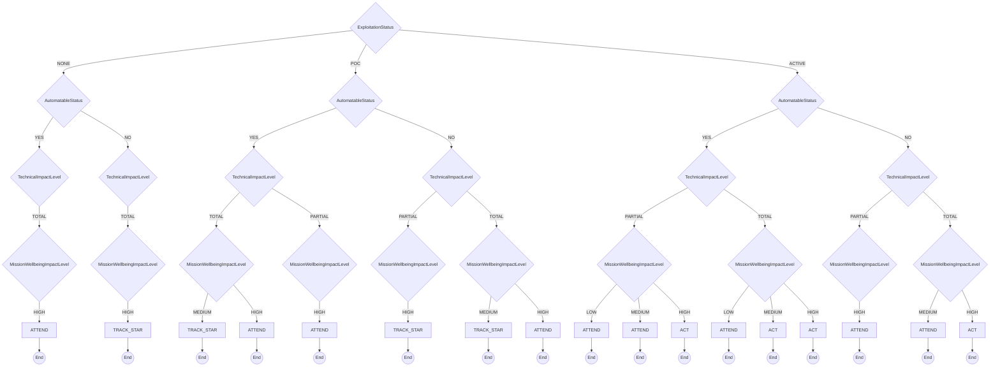
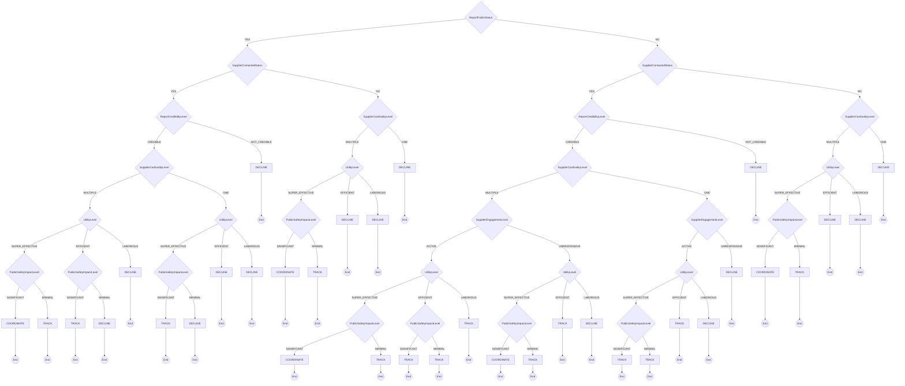

# TypeScript implementation of SSVC (Stakeholder-Specific Vulnerability Categorization)

[](https://www.npmjs.com/package/ssvc)
[](https://github.com/trivialsec/typescript-ssvc/blob/master/LICENSE)
[](https://www.npmjs.com/package/ssvc)

[](https://www.npmjs.com/package/ssvc)

A prioritization framework to triage CVE vulnerabilities as an alternative or compliment to CVSS.

This library now features a **plugin-based architecture** that allows for easy integration of different SSVC methodologies. It includes built-in support for **5 methodologies**:

- **[CISA](#cisa-methodology)** - Stakeholder-Specific Vulnerability Categorization ([docs](docs/cisa.md))
- **[Coordinator Triage](#coordinator-triage-methodology)** - CERT/CC Coordinator Triage Decision Model ([docs](docs/coordinator_triage.md))
- **[Coordinator Publication](#coordinator-publication-methodology)** - CERT/CC Publication Decision Model ([docs](docs/coordinator_publication.md))
- **[Supplier](#supplier-methodology)** - CERT/CC Supplier Decision Model ([docs](docs/supplier.md))
- **[Deployer](#deployer-methodology)** - CERT/CC Deployer Decision Model ([docs](docs/deployer.md))

All methodologies support both **quantitative** (structured decision trees) and **qualitative** (expert judgment) approaches, with the library providing the quantitative framework while allowing for qualitative override based on domain expertise.

#### Other Languages

Check out the [](https://pypi.org/project/ssvc/) Python implementation of SSVC

> Golang is currently in development

## Installation

```sh
npm install ssvc
```

## Quick Start

```javascript
import { createDecision, listMethodologies } from 'ssvc';

// See available methodologies
console.log(listMethodologies()); 
// ['CISA', 'Coordinator Triage', 'Coordinator Publication', 'Supplier', 'Deployer']

// Use CISA methodology
const decision = createDecision('CISA', {
  exploitation: 'active',
  automatable: 'yes',
  technical_impact: 'total',
  mission_wellbeing: 'high'
});

const result = decision.evaluate();
console.log(result); // { action: 'act', priority: 'immediate' }
```

## Plugin-Based Architecture

The library now supports a flexible plugin system where each methodology is a separate plugin. This allows for:

- **Easy extensibility** - Add new methodologies by creating YAML configurations
- **Clean separation** - Each methodology is self-contained
- **Type safety** - Full TypeScript support with generated types
- **Documentation generation** - Automatic mermaid diagrams and markdown docs

## Built-in Methodologies

### CISA Methodology

The CISA Stakeholder-Specific Vulnerability Categorization framework:

```javascript
import { createDecision } from 'ssvc';

const cisaDecision = createDecision('CISA', {
  exploitation: 'active',      // 'none' | 'poc' | 'active'
  automatable: 'yes',          // 'yes' | 'no'  
  technical_impact: 'total',   // 'partial' | 'total'
  mission_wellbeing: 'high'    // 'low' | 'medium' | 'high'
});

const outcome = cisaDecision.evaluate();
// Returns: { action: 'act', priority: 'immediate' }
```

**Possible Actions:**
- `track` → Low priority
- `track*` → Medium priority  
- `attend` → Medium priority
- `act` → Immediate priority

### Coordinator Triage Methodology

The CERT/CC Coordinator Triage Decision Model for vulnerability coordinators:

```javascript
import { createDecision } from 'ssvc';

const coordinatorDecision = createDecision('Coordinator Triage', {
  report_public: 'yes',              // 'yes' | 'no'
  supplier_contacted: 'yes',         // 'yes' | 'no'
  report_credibility: 'credible',    // 'credible' | 'not_credible'
  supplier_cardinality: 'multiple',  // 'one' | 'multiple'
  supplier_engagement: 'active',     // 'active' | 'unresponsive'
  utility: 'super_effective',        // 'laborious' | 'efficient' | 'super_effective'
  public_safety_impact: 'significant' // 'minimal' | 'significant'
});

const outcome = coordinatorDecision.evaluate();
// Returns: { action: 'coordinate', priority: 'high' }
```

**Possible Actions:**
- `decline` → Low priority
- `track` → Medium priority
- `coordinate` → High priority

### Coordinator Publication Methodology

The CERT/CC Coordinator Publication Decision Model for publication decisions:

```javascript
const publicationDecision = createDecision('Coordinator Publication', {
  supplier_involvement: 'fix_ready',           // 'fix_ready' | 'cooperative' | 'uncooperative_unresponsive'
  exploitation: 'active',                      // 'none' | 'public_poc' | 'active'
  public_value_added: 'precedence'             // 'limited' | 'ampliative' | 'precedence'
});

const outcome = publicationDecision.evaluate();
// Returns: { action: 'publish', priority: 'high' }
```

**Possible Actions:**
- `dont_publish` → Low priority
- `publish` → High priority

### Supplier Methodology

The CERT/CC Supplier Decision Model for patch development prioritization:

```javascript
const supplierDecision = createDecision('Supplier', {
  exploitation: 'active',                      // 'none' | 'public_poc' | 'active'
  utility: 'super_effective',                  // 'laborious' | 'efficient' | 'super_effective'
  technical_impact: 'total',                   // 'partial' | 'total'
  public_safety_impact: 'significant'          // 'minimal' | 'significant'
});

const outcome = supplierDecision.evaluate();
// Returns: { action: 'immediate', priority: 'immediate' }
```

**Possible Actions:**
- `defer` → Low priority
- `scheduled` → Medium priority
- `out_of_cycle` → High priority
- `immediate` → Immediate priority

### Deployer Methodology

The CERT/CC Deployer Decision Model for patch deployment prioritization:

```javascript
const deployerDecision = createDecision('Deployer', {
  exploitation: 'active',                      // 'none' | 'public_poc' | 'active'
  system_exposure: 'open',                     // 'small' | 'controlled' | 'open'
  utility: 'super_effective',                  // 'laborious' | 'efficient' | 'super_effective'
  human_impact: 'very_high'                    // 'low' | 'medium' | 'high' | 'very_high'
});

const outcome = deployerDecision.evaluate();
// Returns: { action: 'immediate', priority: 'immediate' }
```

**Possible Actions:**
- `defer` → Low priority
- `scheduled` → Medium priority  
- `out_of_cycle` → High priority
- `immediate` → Immediate priority

## Quantitative vs Qualitative Decision Making

SSVC supports both approaches to vulnerability prioritization:

### Quantitative Approach
The library provides **structured decision trees** with specific criteria and outcomes. This ensures:
- **Consistency** across different analysts
- **Reproducibility** of decisions
- **Transparency** in decision rationale
- **Scalability** for automated processing

### Qualitative Approach
Domain experts can override quantitative results using **expert judgment** when:
- **Context** requires specialized knowledge
- **Edge cases** not covered by decision trees
- **Organizational priorities** differ from standard frameworks
- **Time-sensitive** decisions need immediate action

### Hybrid Approach (Recommended)
1. **Start with quantitative** assessment using the library
2. **Apply qualitative** judgment to validate or override
3. **Document rationale** for any overrides
4. **Learn and adapt** decision trees based on expert feedback

## Advanced Usage

### Using Generated Plugin Classes Directly

```javascript
import { DecisionCisa, CISAExploitationStatus, CISAAutomatableStatus } from 'ssvc';

const decision = new DecisionCisa({
  exploitation: CISAExploitationStatus.ACTIVE,
  automatable: CISAAutomatableStatus.YES,
  technicalImpact: 'total',
  missionWellbeingImpact: 'high'
});

const outcome = decision.evaluate();
```

### Plugin Registration

```javascript
import { PluginRegistry, SSVCPlugin } from 'ssvc';

// Register a custom plugin
const registry = PluginRegistry.getInstance();
registry.register(new MyCustomPlugin());

// List all registered methodologies
const methodologies = registry.list();
```

## Creating Custom Methodologies

You can add new methodologies by creating YAML configuration files and generating TypeScript plugins:

1. **Create a YAML file** in the `methodologies/` directory:

```yaml
name: "My Custom Methodology"
description: "Custom vulnerability categorization"
version: "1.0"

enums:
  SeverityLevel:
    - LOW
    - MEDIUM  
    - HIGH
  ActionType:
    - IGNORE
    - MONITOR
    - PATCH

priorityMap:
  IGNORE: LOW
  MONITOR: MEDIUM
  PATCH: HIGH

decisionTree:
  type: SeverityLevel
  children:
    HIGH: PATCH
    MEDIUM: MONITOR
    LOW: IGNORE

defaultAction: IGNORE
```

2. **Generate the plugin**:

```bash
yarn generate-plugins
```

3. **Use your custom methodology**:

```javascript
const decision = createDecision('My Custom Methodology', {
  severity: 'high'
});
```

## Documentation

Each methodology includes auto-generated documentation with:

- **Decision trees** as mermaid diagrams
- **Enum definitions** and possible values
- **Priority mappings** between actions and priority levels
- **Usage examples** in TypeScript

See the `docs/` directory for detailed methodology documentation.

## Migration from Legacy API

The library maintains backward compatibility with the previous hardcoded API:

```javascript
// Legacy API (still works)
import { Decision, Exploitation, Automatable } from 'ssvc';

const decision = new Decision({
  methodology: 'CISA',
  exploitation: Exploitation.ACTIVE,
  automatable: Automatable.YES,
  technical_impact: 'total',
  mission_wellbeing: 'high'
});

// New Plugin API (recommended)
import { createDecision } from 'ssvc';

const decision = createDecision('CISA', {
  exploitation: 'active',
  automatable: 'yes', 
  technical_impact: 'total',
  mission_wellbeing: 'high'
});
```

## Decision Trees

### CISA


```mermaid
flowchart TD
  0{ExploitationStatus}
  1{AutomatableStatus}
  2{TechnicalImpactLevel}
  3{MissionWellbeingImpactLevel}
  4[ATTEND]
  4 --> 4_end((End))
  5{TechnicalImpactLevel}
  6{MissionWellbeingImpactLevel}
  7[TRACK_STAR]
  7 --> 7_end((End))
  8{AutomatableStatus}
  9{TechnicalImpactLevel}
  10{MissionWellbeingImpactLevel}
  11[TRACK_STAR]
  11 --> 11_end((End))
  12[ATTEND]
  12 --> 12_end((End))
  13{MissionWellbeingImpactLevel}
  14[ATTEND]
  14 --> 14_end((End))
  15{TechnicalImpactLevel}
  16{MissionWellbeingImpactLevel}
  17[TRACK_STAR]
  17 --> 17_end((End))
  18{MissionWellbeingImpactLevel}
  19[TRACK_STAR]
  19 --> 19_end((End))
  20[ATTEND]
  20 --> 20_end((End))
  21{AutomatableStatus}
  22{TechnicalImpactLevel}
  23{MissionWellbeingImpactLevel}
  24[ATTEND]
  24 --> 24_end((End))
  25[ATTEND]
  25 --> 25_end((End))
  26[ACT]
  26 --> 26_end((End))
  27{MissionWellbeingImpactLevel}
  28[ATTEND]
  28 --> 28_end((End))
  29[ACT]
  29 --> 29_end((End))
  30[ACT]
  30 --> 30_end((End))
  31{TechnicalImpactLevel}
  32{MissionWellbeingImpactLevel}
  33[ATTEND]
  33 --> 33_end((End))
  34{MissionWellbeingImpactLevel}
  35[ATTEND]
  35 --> 35_end((End))
  36[ACT]
  36 --> 36_end((End))
  0 -->|NONE| 1
  1 -->|YES| 2
  2 -->|TOTAL| 3
  3 -->|HIGH| 4
  1 -->|NO| 5
  5 -->|TOTAL| 6
  6 -->|HIGH| 7
  0 -->|POC| 8
  8 -->|YES| 9
  9 -->|TOTAL| 10
  10 -->|MEDIUM| 11
  10 -->|HIGH| 12
  9 -->|PARTIAL| 13
  13 -->|HIGH| 14
  8 -->|NO| 15
  15 -->|PARTIAL| 16
  16 -->|HIGH| 17
  15 -->|TOTAL| 18
  18 -->|MEDIUM| 19
  18 -->|HIGH| 20
  0 -->|ACTIVE| 21
  21 -->|YES| 22
  22 -->|PARTIAL| 23
  23 -->|LOW| 24
  23 -->|MEDIUM| 25
  23 -->|HIGH| 26
  22 -->|TOTAL| 27
  27 -->|LOW| 28
  27 -->|MEDIUM| 29
  27 -->|HIGH| 30
  21 -->|NO| 31
  31 -->|PARTIAL| 32
  32 -->|HIGH| 33
  31 -->|TOTAL| 34
  34 -->|MEDIUM| 35
  34 -->|HIGH| 36
```

### Coordinator Triage


```mermaid
flowchart TD
  0{ReportPublicStatus}
  1{SupplierContactedStatus}
  2{ReportCredibilityLevel}
  3{SupplierCardinalityLevel}
  4{UtilityLevel}
  5{PublicSafetyImpactLevel}
  6[COORDINATE]
  6 --> 6_end((End))
  7[TRACK]
  7 --> 7_end((End))
  8{PublicSafetyImpactLevel}
  9[TRACK]
  9 --> 9_end((End))
  10[DECLINE]
  10 --> 10_end((End))
  11[DECLINE]
  11 --> 11_end((End))
  12{UtilityLevel}
  13{PublicSafetyImpactLevel}
  14[TRACK]
  14 --> 14_end((End))
  15[DECLINE]
  15 --> 15_end((End))
  16[DECLINE]
  16 --> 16_end((End))
  17[DECLINE]
  17 --> 17_end((End))
  18[DECLINE]
  18 --> 18_end((End))
  19{SupplierCardinalityLevel}
  20{UtilityLevel}
  21{PublicSafetyImpactLevel}
  22[COORDINATE]
  22 --> 22_end((End))
  23[TRACK]
  23 --> 23_end((End))
  24[DECLINE]
  24 --> 24_end((End))
  25[DECLINE]
  25 --> 25_end((End))
  26[DECLINE]
  26 --> 26_end((End))
  27{SupplierContactedStatus}
  28{ReportCredibilityLevel}
  29{SupplierCardinalityLevel}
  30{SupplierEngagementLevel}
  31{UtilityLevel}
  32{PublicSafetyImpactLevel}
  33[COORDINATE]
  33 --> 33_end((End))
  34[TRACK]
  34 --> 34_end((End))
  35{PublicSafetyImpactLevel}
  36[TRACK]
  36 --> 36_end((End))
  37[TRACK]
  37 --> 37_end((End))
  38[TRACK]
  38 --> 38_end((End))
  39{UtilityLevel}
  40{PublicSafetyImpactLevel}
  41[COORDINATE]
  41 --> 41_end((End))
  42[TRACK]
  42 --> 42_end((End))
  43[TRACK]
  43 --> 43_end((End))
  44[DECLINE]
  44 --> 44_end((End))
  45{SupplierEngagementLevel}
  46{UtilityLevel}
  47{PublicSafetyImpactLevel}
  48[TRACK]
  48 --> 48_end((End))
  49[TRACK]
  49 --> 49_end((End))
  50[TRACK]
  50 --> 50_end((End))
  51[DECLINE]
  51 --> 51_end((End))
  52[DECLINE]
  52 --> 52_end((End))
  53[DECLINE]
  53 --> 53_end((End))
  54{SupplierCardinalityLevel}
  55{UtilityLevel}
  56{PublicSafetyImpactLevel}
  57[COORDINATE]
  57 --> 57_end((End))
  58[TRACK]
  58 --> 58_end((End))
  59[DECLINE]
  59 --> 59_end((End))
  60[DECLINE]
  60 --> 60_end((End))
  61[DECLINE]
  61 --> 61_end((End))
  0 -->|YES| 1
  1 -->|YES| 2
  2 -->|CREDIBLE| 3
  3 -->|MULTIPLE| 4
  4 -->|SUPER_EFFECTIVE| 5
  5 -->|SIGNIFICANT| 6
  5 -->|MINIMAL| 7
  4 -->|EFFICIENT| 8
  8 -->|SIGNIFICANT| 9
  8 -->|MINIMAL| 10
  4 -->|LABORIOUS| 11
  3 -->|ONE| 12
  12 -->|SUPER_EFFECTIVE| 13
  13 -->|SIGNIFICANT| 14
  13 -->|MINIMAL| 15
  12 -->|EFFICIENT| 16
  12 -->|LABORIOUS| 17
  2 -->|NOT_CREDIBLE| 18
  1 -->|NO| 19
  19 -->|MULTIPLE| 20
  20 -->|SUPER_EFFECTIVE| 21
  21 -->|SIGNIFICANT| 22
  21 -->|MINIMAL| 23
  20 -->|EFFICIENT| 24
  20 -->|LABORIOUS| 25
  19 -->|ONE| 26
  0 -->|NO| 27
  27 -->|YES| 28
  28 -->|CREDIBLE| 29
  29 -->|MULTIPLE| 30
  30 -->|ACTIVE| 31
  31 -->|SUPER_EFFECTIVE| 32
  32 -->|SIGNIFICANT| 33
  32 -->|MINIMAL| 34
  31 -->|EFFICIENT| 35
  35 -->|SIGNIFICANT| 36
  35 -->|MINIMAL| 37
  31 -->|LABORIOUS| 38
  30 -->|UNRESPONSIVE| 39
  39 -->|SUPER_EFFECTIVE| 40
  40 -->|SIGNIFICANT| 41
  40 -->|MINIMAL| 42
  39 -->|EFFICIENT| 43
  39 -->|LABORIOUS| 44
  29 -->|ONE| 45
  45 -->|ACTIVE| 46
  46 -->|SUPER_EFFECTIVE| 47
  47 -->|SIGNIFICANT| 48
  47 -->|MINIMAL| 49
  46 -->|EFFICIENT| 50
  46 -->|LABORIOUS| 51
  45 -->|UNRESPONSIVE| 52
  28 -->|NOT_CREDIBLE| 53
  27 -->|NO| 54
  54 -->|MULTIPLE| 55
  55 -->|SUPER_EFFECTIVE| 56
  56 -->|SIGNIFICANT| 57
  56 -->|MINIMAL| 58
  55 -->|EFFICIENT| 59
  55 -->|LABORIOUS| 60
  54 -->|ONE| 61
```

## Development

### Building

```bash
yarn build
```

### Testing

```bash
yarn test
```

### Generating Plugins

```bash
yarn generate-plugins
```

This will process all YAML files in `methodologies/` and generate:
- TypeScript plugin files in `src/plugins/`
- Documentation with mermaid diagrams in `docs/`

## Contributing

1. Add your methodology as a YAML file in `methodologies/`
2. Run `yarn generate-plugins` to create the TypeScript plugin
3. Add tests for your methodology
4. Submit a pull request

## License

MIT