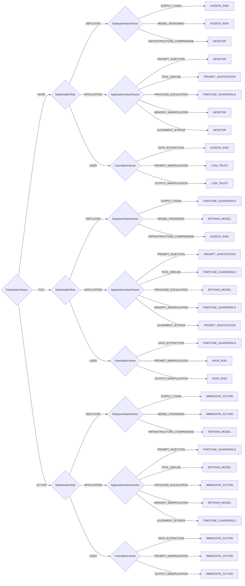

# AI/LLM Triage

AI and LLM Vulnerability Triage for stakeholder-specific decision making

**Version:** 1.0

## Decision Tree



## Enums

### ExploitationStatus

- NONE
- POC
- ACTIVE

### StakeholderRole

- DEPLOYER
- APPLICATION
- USER

### DeployerAttackVector

- SUPPLY_CHAIN
- MODEL_POISONING
- INFRASTRUCTURE_COMPROMISE

### ApplicationAttackVector

- PROMPT_INJECTION
- TOOL_MISUSE
- PRIVILEGE_ESCALATION
- MEMORY_MANIPULATION
- ALIGNMENT_BYPASS

### UserAttackVector

- DATA_EXTRACTION
- PROMPT_MANIPULATION
- OUTPUT_MANIPULATION

## Priority Mapping

- **MONITOR** → LOW
- **ASSESS_RISK** → LOW
- **PROMPT_SANITIZATION** → MEDIUM
- **FINETUNE_GUARDRAILS** → MEDIUM
- **RETRAIN_MODEL** → HIGH
- **HIGH_RISK** → HIGH
- **LOW_TRUST** → MEDIUM
- **IMMEDIATE_ACTION** → IMMEDIATE

## Usage

```typescript
import { DecisionAiLlmTriage } from "./plugins/ai_llm_triage";

const decision = new DecisionAiLlmTriage({
  // Add parameters based on methodology
});

const outcome = decision.evaluate();
console.log(outcome.action, outcome.priority);
```

## Vector String Support

This methodology supports SSVC vector strings for compact representation and interchange.

### Parameter Abbreviations

| Parameter                 | Abbreviation | Value Mappings                                                                                            |
| ------------------------- | ------------ | --------------------------------------------------------------------------------------------------------- |
| exploitation              | E            | NONE→N, POC→P, ACTIVE→A                                                                                   |
| stakeholder_role          | SR           | DEPLOYER→D, APPLICATION→A, USER→U                                                                         |
| deployer_attack_vector    | DAV          | SUPPLY_CHAIN→SC, MODEL_POISONING→MP, INFRASTRUCTURE_COMPROMISE→IC                                         |
| application_attack_vector | AAV          | PROMPT_INJECTION→PI, TOOL_MISUSE→TM, PRIVILEGE_ESCALATION→PE, MEMORY_MANIPULATION→MM, ALIGNMENT_BYPASS→AB |
| user_attack_vector        | UAV          | DATA_EXTRACTION→DE, PROMPT_MANIPULATION→PM, OUTPUT_MANIPULATION→OM                                        |

### Vector String Format

```
AI_LLMv2/[parameters]/[timestamp]/
```

### Example Usage

```typescript
// Generate vector string from decision
const decision = new DecisionAiLlmTriage({
  exploitation: "NONE",
  stakeholder_role: "DEPLOYER",
  deployer_attack_vector: "SUPPLY_CHAIN",
  application_attack_vector: "PROMPT_INJECTION",
  user_attack_vector: "DATA_EXTRACTION",
});

const vectorString = decision.toVector();
console.log(vectorString);
// Output: AI_LLMv2/E:N/SR:D/DAV:SC/AAV:PI/UAV:DE/2024-07-23T20:34:21.000Z/

// Parse vector string to create decision
const parsedDecision = DecisionAiLlmTriage.fromVector(
  "AI_LLMv2/E:N/SR:D/DAV:SC/AAV:PI/UAV:DE/2024-07-23T20:34:21.000Z/",
);
const outcome = parsedDecision.evaluate();
```

## File Integrity Verification

The generated files in this methodology have SHA1 checksums for verification:

### Checksum Verification Commands

Verify the integrity of generated files using these commands:

```bash
# Verify TypeScript plugin file
echo "62bd31b5580d96280d558b35b427aac925fae461  /home/chris/github/typescript-ssvc/src/plugins/ai_llm_triage-generated.ts" | sha1sum -c
```

**Why This Matters**: Checksum verification ensures that generated files haven't been tampered with or corrupted. This is important for:

- **Security**: Detecting unauthorized modifications to generated code
- **Integrity**: Ensuring files match their expected content exactly
- **Trust**: Providing cryptographic proof that files are authentic
- **Debugging**: Confirming file corruption isn't causing unexpected behavior

Always verify checksums before deploying or using generated files in production environments.
