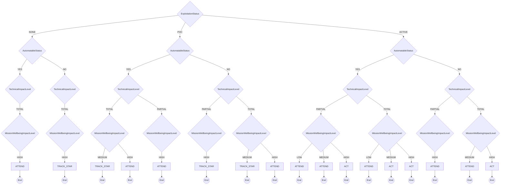

# CISA

CISA Stakeholder-Specific Vulnerability Categorization

**Version:** 1.0
**URL:** https://www.cisa.gov/stakeholder-specific-vulnerability-categorization-ssvc

## Decision Tree



## Enums

### ExploitationStatus
- NONE
- POC
- ACTIVE

### AutomatableStatus
- YES
- NO

### TechnicalImpactLevel
- PARTIAL
- TOTAL

### MissionWellbeingImpactLevel
- LOW
- MEDIUM
- HIGH

### DecisionPriorityLevel
- LOW
- MEDIUM
- HIGH
- IMMEDIATE

### ActionType
- TRACK
- TRACK_STAR
- ATTEND
- ACT

## Priority Mapping

- **TRACK** → LOW
- **TRACK_STAR** → MEDIUM
- **ATTEND** → MEDIUM
- **ACT** → IMMEDIATE

## Usage

```typescript
import { DecisionCisa } from './plugins/cisa';

const decision = new DecisionCisa({
  // Add parameters based on methodology
});

const outcome = decision.evaluate();
console.log(outcome.action, outcome.priority);
```
