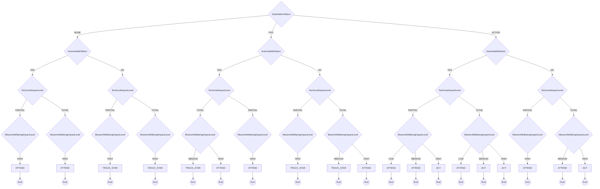

# CISA

CISA Stakeholder-Specific Vulnerability Categorization

**Version:** 1.0
**URL:** https://www.cisa.gov/stakeholder-specific-vulnerability-categorization-ssvc

## Decision Tree



## Enums

### ExploitationStatus
- NONE
- POC
- ACTIVE

### AutomatableStatus
- YES
- NO

### TechnicalImpactLevel
- PARTIAL
- TOTAL

### MissionWellbeingImpactLevel
- LOW
- MEDIUM
- HIGH

## Priority Mapping

- **TRACK** → LOW
- **TRACK_STAR** → MEDIUM
- **ATTEND** → MEDIUM
- **ACT** → IMMEDIATE

## Usage

```typescript
import { DecisionCisa } from './plugins/cisa';

const decision = new DecisionCisa({
  // Add parameters based on methodology
});

const outcome = decision.evaluate();
console.log(outcome.action, outcome.priority);
```

## Vector String Support

This methodology supports SSVC vector strings for compact representation and interchange.

### Parameter Abbreviations

| Parameter | Abbreviation | Value Mappings |
|-----------|--------------|----------------|
| exploitation | E | NONE→N, POC→P, ACTIVE→A |
| automatable | A | YES→Y, NO→N |
| technical_impact | T | PARTIAL→P, TOTAL→T |
| mission_wellbeing | M | LOW→L, MEDIUM→M, HIGH→H |

### Vector String Format

```
CISAv1/[parameters]/[timestamp]/
```

### Example Usage

```typescript
// Generate vector string from decision
const decision = new DecisionCisa({
  exploitation: "NONE",
  automatable: "YES",
  technical_impact: "PARTIAL",
  mission_wellbeing: "LOW"
});

const vectorString = decision.toVector();
console.log(vectorString);
// Output: CISAv1/E:N/A:Y/T:P/M:L/2024-07-23T20:34:21.000Z/

// Parse vector string to create decision
const parsedDecision = DecisionCisa.fromVector("CISAv1/E:N/A:Y/T:P/M:L/2024-07-23T20:34:21.000Z/");
const outcome = parsedDecision.evaluate();
```

## File Integrity Verification

The generated files in this methodology have SHA1 checksums for verification:

### Checksum Verification Commands

Verify the integrity of generated files using these commands:

```bash
# Verify TypeScript plugin file
echo "86ddad0d26da8fae95a05e3fab5ac57ecbcfeff7  /home/chris/github/typescript-ssvc/src/plugins/cisa-generated.ts" | sha1sum -c
```

**Why This Matters**: Checksum verification ensures that generated files haven't been tampered with or corrupted. This is important for:
- **Security**: Detecting unauthorized modifications to generated code
- **Integrity**: Ensuring files match their expected content exactly  
- **Trust**: Providing cryptographic proof that files are authentic
- **Debugging**: Confirming file corruption isn't causing unexpected behavior

Always verify checksums before deploying or using generated files in production environments.
