# Coordinator Publication

CERT/CC Coordinator Publication Decision Model

**Version:** 1.0
**URL:** https://certcc.github.io/SSVC/howto/publication_decision/

## Decision Tree

```mermaid
flowchart TD
  0{SupplierInvolvementLevel}
  1{ExploitationStatus}
  2{PublicValueAddedLevel}
  3[dont_publish]
  3 --> 3_end((End))
  4[publish]
  4 --> 4_end((End))
  5[publish]
  5 --> 5_end((End))
  6{PublicValueAddedLevel}
  7[dont_publish]
  7 --> 7_end((End))
  8[publish]
  8 --> 8_end((End))
  9[publish]
  9 --> 9_end((End))
  10{PublicValueAddedLevel}
  11[publish]
  11 --> 11_end((End))
  12[publish]
  12 --> 12_end((End))
  13[publish]
  13 --> 13_end((End))
  14{ExploitationStatus}
  15{PublicValueAddedLevel}
  16[dont_publish]
  16 --> 16_end((End))
  17[dont_publish]
  17 --> 17_end((End))
  18[publish]
  18 --> 18_end((End))
  19{PublicValueAddedLevel}
  20[dont_publish]
  20 --> 20_end((End))
  21[publish]
  21 --> 21_end((End))
  22[publish]
  22 --> 22_end((End))
  23{PublicValueAddedLevel}
  24[publish]
  24 --> 24_end((End))
  25[publish]
  25 --> 25_end((End))
  26[publish]
  26 --> 26_end((End))
  27{ExploitationStatus}
  28{PublicValueAddedLevel}
  29[dont_publish]
  29 --> 29_end((End))
  30[dont_publish]
  30 --> 30_end((End))
  31[publish]
  31 --> 31_end((End))
  32{PublicValueAddedLevel}
  33[publish]
  33 --> 33_end((End))
  34[publish]
  34 --> 34_end((End))
  35[publish]
  35 --> 35_end((End))
  36{PublicValueAddedLevel}
  37[publish]
  37 --> 37_end((End))
  38[publish]
  38 --> 38_end((End))
  39[publish]
  39 --> 39_end((End))
  0 -->|fix_ready| 1
  1 -->|none| 2
  2 -->|limited| 3
  2 -->|ampliative| 4
  2 -->|precedence| 5
  1 -->|public_poc| 6
  6 -->|limited| 7
  6 -->|ampliative| 8
  6 -->|precedence| 9
  1 -->|active| 10
  10 -->|limited| 11
  10 -->|ampliative| 12
  10 -->|precedence| 13
  0 -->|cooperative| 14
  14 -->|none| 15
  15 -->|limited| 16
  15 -->|ampliative| 17
  15 -->|precedence| 18
  14 -->|public_poc| 19
  19 -->|limited| 20
  19 -->|ampliative| 21
  19 -->|precedence| 22
  14 -->|active| 23
  23 -->|limited| 24
  23 -->|ampliative| 25
  23 -->|precedence| 26
  0 -->|uncooperative_unresponsive| 27
  27 -->|none| 28
  28 -->|limited| 29
  28 -->|ampliative| 30
  28 -->|precedence| 31
  27 -->|public_poc| 32
  32 -->|limited| 33
  32 -->|ampliative| 34
  32 -->|precedence| 35
  27 -->|active| 36
  36 -->|limited| 37
  36 -->|ampliative| 38
  36 -->|precedence| 39
```



## Enums

### SupplierInvolvementLevel
- fix_ready
- cooperative
- uncooperative_unresponsive

### ExploitationStatus
- none
- public_poc
- active

### PublicValueAddedLevel
- limited
- ampliative
- precedence

## Priority Mapping

- **publish** → high
- **dont_publish** → low

## Usage

```typescript
import { DecisionCoordinatorPublication } from './plugins/coordinator_publication';

const decision = new DecisionCoordinatorPublication({
  // Add parameters based on methodology
});

const outcome = decision.evaluate();
console.log(outcome.action, outcome.priority);
```

## Vector String Support

This methodology supports SSVC vector strings for compact representation and interchange.

### Parameter Abbreviations

| Parameter | Abbreviation | Value Mappings |
|-----------|--------------|----------------|
| supplier_involvement | SI | fix_ready→F, cooperative→C, uncooperative_unresponsive→U |
| exploitation | E | none→N, public_poc→P, active→A |
| public_value_added | PV | limited→L, ampliative→A, precedence→P |

### Vector String Format

```
COORD_PUBv1/[parameters]/[timestamp]/
```

### Example Usage

```typescript
// Generate vector string from decision
const decision = new DecisionCoordinatorPublication({
  supplier_involvement: "fix_ready",
  exploitation: "none",
  public_value_added: "limited"
});

const vectorString = decision.toVector();
console.log(vectorString);
// Output: COORD_PUBv1/SI:F/E:N/PV:L/2024-07-23T20:34:21.000Z/

// Parse vector string to create decision
const parsedDecision = DecisionCoordinatorPublication.fromVector("COORD_PUBv1/SI:F/E:N/PV:L/2024-07-23T20:34:21.000Z/");
const outcome = parsedDecision.evaluate();
```

## File Integrity Verification

The generated files in this methodology have SHA1 checksums for verification:

### Checksum Verification Commands

Verify the integrity of generated files using these commands:

```bash
# Verify TypeScript plugin file
echo "087bc850ed2915623cb8430cd1a7cc0aec06e549  /home/chris/github/typescript-ssvc/src/plugins/coordinator_publication-generated.ts" | sha1sum -c
```

**Why This Matters**: Checksum verification ensures that generated files haven't been tampered with or corrupted. This is important for:
- **Security**: Detecting unauthorized modifications to generated code
- **Integrity**: Ensuring files match their expected content exactly  
- **Trust**: Providing cryptographic proof that files are authentic
- **Debugging**: Confirming file corruption isn't causing unexpected behavior

Always verify checksums before deploying or using generated files in production environments.
