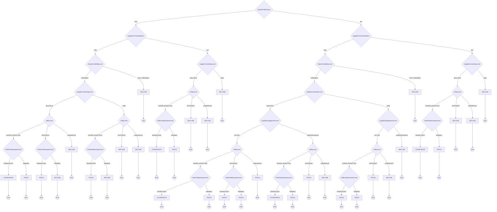

# Coordinator Triage

CERT/CC Coordinator Triage Decision Model

**Version:** 1.0
**URL:** https://certcc.github.io/SSVC/howto/coordination_triage_decision/

## Decision Tree



## Enums

### ReportPublicStatus
- YES
- NO

### SupplierContactedStatus
- YES
- NO

### ReportCredibilityLevel
- CREDIBLE
- NOT_CREDIBLE

### SupplierCardinalityLevel
- ONE
- MULTIPLE

### SupplierEngagementLevel
- ACTIVE
- UNRESPONSIVE

### UtilityLevel
- LABORIOUS
- EFFICIENT
- SUPER_EFFECTIVE

### PublicSafetyImpactLevel
- MINIMAL
- SIGNIFICANT

### ActionType
- DECLINE
- TRACK
- COORDINATE

### DecisionPriorityLevel
- LOW
- MEDIUM
- HIGH

## Priority Mapping

- **DECLINE** → LOW
- **TRACK** → MEDIUM
- **COORDINATE** → HIGH

## Usage

```typescript
import { DecisionCoordinatorTriage } from './plugins/coordinator_triage';

const decision = new DecisionCoordinatorTriage({
  // Add parameters based on methodology
});

const outcome = decision.evaluate();
console.log(outcome.action, outcome.priority);
```
