# Coordinator Triage

CERT/CC Coordinator Triage Decision Model

**Version:** 1.0
**URL:** https://certcc.github.io/SSVC/howto/coordination_triage_decision/

## Decision Tree

```mermaid
flowchart TD
  0{ReportPublicStatus}
  1{SupplierContactedStatus}
  2{ReportCredibilityLevel}
  3{SupplierCardinalityLevel}
  4{UtilityLevel}
  5{PublicSafetyImpactLevel}
  6[COORDINATE]
  6 --> 6_end((End))
  7[TRACK]
  7 --> 7_end((End))
  8{PublicSafetyImpactLevel}
  9[TRACK]
  9 --> 9_end((End))
  10[DECLINE]
  10 --> 10_end((End))
  11{PublicSafetyImpactLevel}
  12[DECLINE]
  12 --> 12_end((End))
  13[DECLINE]
  13 --> 13_end((End))
  14{UtilityLevel}
  15{PublicSafetyImpactLevel}
  16[TRACK]
  16 --> 16_end((End))
  17[DECLINE]
  17 --> 17_end((End))
  18{PublicSafetyImpactLevel}
  19[DECLINE]
  19 --> 19_end((End))
  20[DECLINE]
  20 --> 20_end((End))
  21{PublicSafetyImpactLevel}
  22[DECLINE]
  22 --> 22_end((End))
  23[DECLINE]
  23 --> 23_end((End))
  24{SupplierCardinalityLevel}
  25{UtilityLevel}
  26{PublicSafetyImpactLevel}
  27[DECLINE]
  27 --> 27_end((End))
  28[DECLINE]
  28 --> 28_end((End))
  29{PublicSafetyImpactLevel}
  30[DECLINE]
  30 --> 30_end((End))
  31[DECLINE]
  31 --> 31_end((End))
  32{PublicSafetyImpactLevel}
  33[DECLINE]
  33 --> 33_end((End))
  34[DECLINE]
  34 --> 34_end((End))
  35{UtilityLevel}
  36{PublicSafetyImpactLevel}
  37[DECLINE]
  37 --> 37_end((End))
  38[DECLINE]
  38 --> 38_end((End))
  39{PublicSafetyImpactLevel}
  40[DECLINE]
  40 --> 40_end((End))
  41[DECLINE]
  41 --> 41_end((End))
  42{PublicSafetyImpactLevel}
  43[DECLINE]
  43 --> 43_end((End))
  44[DECLINE]
  44 --> 44_end((End))
  45{ReportCredibilityLevel}
  46{SupplierCardinalityLevel}
  47{UtilityLevel}
  48{PublicSafetyImpactLevel}
  49[COORDINATE]
  49 --> 49_end((End))
  50[TRACK]
  50 --> 50_end((End))
  51{PublicSafetyImpactLevel}
  52[DECLINE]
  52 --> 52_end((End))
  53[DECLINE]
  53 --> 53_end((End))
  54{PublicSafetyImpactLevel}
  55[DECLINE]
  55 --> 55_end((End))
  56[DECLINE]
  56 --> 56_end((End))
  57{UtilityLevel}
  58{PublicSafetyImpactLevel}
  59[DECLINE]
  59 --> 59_end((End))
  60[DECLINE]
  60 --> 60_end((End))
  61{PublicSafetyImpactLevel}
  62[DECLINE]
  62 --> 62_end((End))
  63[DECLINE]
  63 --> 63_end((End))
  64{PublicSafetyImpactLevel}
  65[DECLINE]
  65 --> 65_end((End))
  66[DECLINE]
  66 --> 66_end((End))
  67{SupplierCardinalityLevel}
  68{UtilityLevel}
  69{PublicSafetyImpactLevel}
  70[DECLINE]
  70 --> 70_end((End))
  71[DECLINE]
  71 --> 71_end((End))
  72{PublicSafetyImpactLevel}
  73[DECLINE]
  73 --> 73_end((End))
  74[DECLINE]
  74 --> 74_end((End))
  75{PublicSafetyImpactLevel}
  76[DECLINE]
  76 --> 76_end((End))
  77[DECLINE]
  77 --> 77_end((End))
  78{UtilityLevel}
  79{PublicSafetyImpactLevel}
  80[DECLINE]
  80 --> 80_end((End))
  81[DECLINE]
  81 --> 81_end((End))
  82{PublicSafetyImpactLevel}
  83[DECLINE]
  83 --> 83_end((End))
  84[DECLINE]
  84 --> 84_end((End))
  85{PublicSafetyImpactLevel}
  86[DECLINE]
  86 --> 86_end((End))
  87[DECLINE]
  87 --> 87_end((End))
  88{SupplierContactedStatus}
  89{ReportCredibilityLevel}
  90{SupplierCardinalityLevel}
  91{UtilityLevel}
  92{PublicSafetyImpactLevel}
  93[COORDINATE]
  93 --> 93_end((End))
  94[TRACK]
  94 --> 94_end((End))
  95{PublicSafetyImpactLevel}
  96[TRACK]
  96 --> 96_end((End))
  97[TRACK]
  97 --> 97_end((End))
  98{PublicSafetyImpactLevel}
  99[TRACK]
  99 --> 99_end((End))
  100[DECLINE]
  100 --> 100_end((End))
  101{UtilityLevel}
  102{PublicSafetyImpactLevel}
  103[TRACK]
  103 --> 103_end((End))
  104[TRACK]
  104 --> 104_end((End))
  105{PublicSafetyImpactLevel}
  106[TRACK]
  106 --> 106_end((End))
  107[DECLINE]
  107 --> 107_end((End))
  108{PublicSafetyImpactLevel}
  109[DECLINE]
  109 --> 109_end((End))
  110[DECLINE]
  110 --> 110_end((End))
  111{SupplierCardinalityLevel}
  112{UtilityLevel}
  113{PublicSafetyImpactLevel}
  114[DECLINE]
  114 --> 114_end((End))
  115[DECLINE]
  115 --> 115_end((End))
  116{PublicSafetyImpactLevel}
  117[DECLINE]
  117 --> 117_end((End))
  118[DECLINE]
  118 --> 118_end((End))
  119{PublicSafetyImpactLevel}
  120[DECLINE]
  120 --> 120_end((End))
  121[DECLINE]
  121 --> 121_end((End))
  122{UtilityLevel}
  123{PublicSafetyImpactLevel}
  124[DECLINE]
  124 --> 124_end((End))
  125[DECLINE]
  125 --> 125_end((End))
  126{PublicSafetyImpactLevel}
  127[DECLINE]
  127 --> 127_end((End))
  128[DECLINE]
  128 --> 128_end((End))
  129{PublicSafetyImpactLevel}
  130[DECLINE]
  130 --> 130_end((End))
  131[DECLINE]
  131 --> 131_end((End))
  132{ReportCredibilityLevel}
  133{SupplierCardinalityLevel}
  134{UtilityLevel}
  135{PublicSafetyImpactLevel}
  136[COORDINATE]
  136 --> 136_end((End))
  137[TRACK]
  137 --> 137_end((End))
  138{PublicSafetyImpactLevel}
  139[DECLINE]
  139 --> 139_end((End))
  140[DECLINE]
  140 --> 140_end((End))
  141{PublicSafetyImpactLevel}
  142[DECLINE]
  142 --> 142_end((End))
  143[DECLINE]
  143 --> 143_end((End))
  144{UtilityLevel}
  145{PublicSafetyImpactLevel}
  146[DECLINE]
  146 --> 146_end((End))
  147[DECLINE]
  147 --> 147_end((End))
  148{PublicSafetyImpactLevel}
  149[DECLINE]
  149 --> 149_end((End))
  150[DECLINE]
  150 --> 150_end((End))
  151{PublicSafetyImpactLevel}
  152[DECLINE]
  152 --> 152_end((End))
  153[DECLINE]
  153 --> 153_end((End))
  154{SupplierCardinalityLevel}
  155{UtilityLevel}
  156{PublicSafetyImpactLevel}
  157[DECLINE]
  157 --> 157_end((End))
  158[DECLINE]
  158 --> 158_end((End))
  159{PublicSafetyImpactLevel}
  160[DECLINE]
  160 --> 160_end((End))
  161[DECLINE]
  161 --> 161_end((End))
  162{PublicSafetyImpactLevel}
  163[DECLINE]
  163 --> 163_end((End))
  164[DECLINE]
  164 --> 164_end((End))
  165{UtilityLevel}
  166{PublicSafetyImpactLevel}
  167[DECLINE]
  167 --> 167_end((End))
  168[DECLINE]
  168 --> 168_end((End))
  169{PublicSafetyImpactLevel}
  170[DECLINE]
  170 --> 170_end((End))
  171[DECLINE]
  171 --> 171_end((End))
  172{PublicSafetyImpactLevel}
  173[DECLINE]
  173 --> 173_end((End))
  174[DECLINE]
  174 --> 174_end((End))
  0 -->|YES| 1
  1 -->|YES| 2
  2 -->|CREDIBLE| 3
  3 -->|MULTIPLE| 4
  4 -->|SUPER_EFFECTIVE| 5
  5 -->|SIGNIFICANT| 6
  5 -->|MINIMAL| 7
  4 -->|EFFICIENT| 8
  8 -->|SIGNIFICANT| 9
  8 -->|MINIMAL| 10
  4 -->|LABORIOUS| 11
  11 -->|SIGNIFICANT| 12
  11 -->|MINIMAL| 13
  3 -->|ONE| 14
  14 -->|SUPER_EFFECTIVE| 15
  15 -->|SIGNIFICANT| 16
  15 -->|MINIMAL| 17
  14 -->|EFFICIENT| 18
  18 -->|SIGNIFICANT| 19
  18 -->|MINIMAL| 20
  14 -->|LABORIOUS| 21
  21 -->|SIGNIFICANT| 22
  21 -->|MINIMAL| 23
  2 -->|NOT_CREDIBLE| 24
  24 -->|MULTIPLE| 25
  25 -->|SUPER_EFFECTIVE| 26
  26 -->|SIGNIFICANT| 27
  26 -->|MINIMAL| 28
  25 -->|EFFICIENT| 29
  29 -->|SIGNIFICANT| 30
  29 -->|MINIMAL| 31
  25 -->|LABORIOUS| 32
  32 -->|SIGNIFICANT| 33
  32 -->|MINIMAL| 34
  24 -->|ONE| 35
  35 -->|SUPER_EFFECTIVE| 36
  36 -->|SIGNIFICANT| 37
  36 -->|MINIMAL| 38
  35 -->|EFFICIENT| 39
  39 -->|SIGNIFICANT| 40
  39 -->|MINIMAL| 41
  35 -->|LABORIOUS| 42
  42 -->|SIGNIFICANT| 43
  42 -->|MINIMAL| 44
  1 -->|NO| 45
  45 -->|CREDIBLE| 46
  46 -->|MULTIPLE| 47
  47 -->|SUPER_EFFECTIVE| 48
  48 -->|SIGNIFICANT| 49
  48 -->|MINIMAL| 50
  47 -->|EFFICIENT| 51
  51 -->|SIGNIFICANT| 52
  51 -->|MINIMAL| 53
  47 -->|LABORIOUS| 54
  54 -->|SIGNIFICANT| 55
  54 -->|MINIMAL| 56
  46 -->|ONE| 57
  57 -->|SUPER_EFFECTIVE| 58
  58 -->|SIGNIFICANT| 59
  58 -->|MINIMAL| 60
  57 -->|EFFICIENT| 61
  61 -->|SIGNIFICANT| 62
  61 -->|MINIMAL| 63
  57 -->|LABORIOUS| 64
  64 -->|SIGNIFICANT| 65
  64 -->|MINIMAL| 66
  45 -->|NOT_CREDIBLE| 67
  67 -->|MULTIPLE| 68
  68 -->|SUPER_EFFECTIVE| 69
  69 -->|SIGNIFICANT| 70
  69 -->|MINIMAL| 71
  68 -->|EFFICIENT| 72
  72 -->|SIGNIFICANT| 73
  72 -->|MINIMAL| 74
  68 -->|LABORIOUS| 75
  75 -->|SIGNIFICANT| 76
  75 -->|MINIMAL| 77
  67 -->|ONE| 78
  78 -->|SUPER_EFFECTIVE| 79
  79 -->|SIGNIFICANT| 80
  79 -->|MINIMAL| 81
  78 -->|EFFICIENT| 82
  82 -->|SIGNIFICANT| 83
  82 -->|MINIMAL| 84
  78 -->|LABORIOUS| 85
  85 -->|SIGNIFICANT| 86
  85 -->|MINIMAL| 87
  0 -->|NO| 88
  88 -->|YES| 89
  89 -->|CREDIBLE| 90
  90 -->|MULTIPLE| 91
  91 -->|SUPER_EFFECTIVE| 92
  92 -->|SIGNIFICANT| 93
  92 -->|MINIMAL| 94
  91 -->|EFFICIENT| 95
  95 -->|SIGNIFICANT| 96
  95 -->|MINIMAL| 97
  91 -->|LABORIOUS| 98
  98 -->|SIGNIFICANT| 99
  98 -->|MINIMAL| 100
  90 -->|ONE| 101
  101 -->|SUPER_EFFECTIVE| 102
  102 -->|SIGNIFICANT| 103
  102 -->|MINIMAL| 104
  101 -->|EFFICIENT| 105
  105 -->|SIGNIFICANT| 106
  105 -->|MINIMAL| 107
  101 -->|LABORIOUS| 108
  108 -->|SIGNIFICANT| 109
  108 -->|MINIMAL| 110
  89 -->|NOT_CREDIBLE| 111
  111 -->|MULTIPLE| 112
  112 -->|SUPER_EFFECTIVE| 113
  113 -->|SIGNIFICANT| 114
  113 -->|MINIMAL| 115
  112 -->|EFFICIENT| 116
  116 -->|SIGNIFICANT| 117
  116 -->|MINIMAL| 118
  112 -->|LABORIOUS| 119
  119 -->|SIGNIFICANT| 120
  119 -->|MINIMAL| 121
  111 -->|ONE| 122
  122 -->|SUPER_EFFECTIVE| 123
  123 -->|SIGNIFICANT| 124
  123 -->|MINIMAL| 125
  122 -->|EFFICIENT| 126
  126 -->|SIGNIFICANT| 127
  126 -->|MINIMAL| 128
  122 -->|LABORIOUS| 129
  129 -->|SIGNIFICANT| 130
  129 -->|MINIMAL| 131
  88 -->|NO| 132
  132 -->|CREDIBLE| 133
  133 -->|MULTIPLE| 134
  134 -->|SUPER_EFFECTIVE| 135
  135 -->|SIGNIFICANT| 136
  135 -->|MINIMAL| 137
  134 -->|EFFICIENT| 138
  138 -->|SIGNIFICANT| 139
  138 -->|MINIMAL| 140
  134 -->|LABORIOUS| 141
  141 -->|SIGNIFICANT| 142
  141 -->|MINIMAL| 143
  133 -->|ONE| 144
  144 -->|SUPER_EFFECTIVE| 145
  145 -->|SIGNIFICANT| 146
  145 -->|MINIMAL| 147
  144 -->|EFFICIENT| 148
  148 -->|SIGNIFICANT| 149
  148 -->|MINIMAL| 150
  144 -->|LABORIOUS| 151
  151 -->|SIGNIFICANT| 152
  151 -->|MINIMAL| 153
  132 -->|NOT_CREDIBLE| 154
  154 -->|MULTIPLE| 155
  155 -->|SUPER_EFFECTIVE| 156
  156 -->|SIGNIFICANT| 157
  156 -->|MINIMAL| 158
  155 -->|EFFICIENT| 159
  159 -->|SIGNIFICANT| 160
  159 -->|MINIMAL| 161
  155 -->|LABORIOUS| 162
  162 -->|SIGNIFICANT| 163
  162 -->|MINIMAL| 164
  154 -->|ONE| 165
  165 -->|SUPER_EFFECTIVE| 166
  166 -->|SIGNIFICANT| 167
  166 -->|MINIMAL| 168
  165 -->|EFFICIENT| 169
  169 -->|SIGNIFICANT| 170
  169 -->|MINIMAL| 171
  165 -->|LABORIOUS| 172
  172 -->|SIGNIFICANT| 173
  172 -->|MINIMAL| 174
```



## Enums

### ReportPublicStatus
- YES
- NO

### SupplierContactedStatus
- YES
- NO

### ReportCredibilityLevel
- CREDIBLE
- NOT_CREDIBLE

### SupplierCardinalityLevel
- ONE
- MULTIPLE

### UtilityLevel
- LABORIOUS
- EFFICIENT
- SUPER_EFFECTIVE

### PublicSafetyImpactLevel
- MINIMAL
- SIGNIFICANT

## Priority Mapping

- **DECLINE** → LOW
- **TRACK** → MEDIUM
- **COORDINATE** → HIGH

## Usage

```typescript
import { DecisionCoordinatorTriage } from './plugins/coordinator_triage';

const decision = new DecisionCoordinatorTriage({
  // Add parameters based on methodology
});

const outcome = decision.evaluate();
console.log(outcome.action, outcome.priority);
```

## Vector String Support

This methodology supports SSVC vector strings for compact representation and interchange.

### Parameter Abbreviations

| Parameter | Abbreviation | Value Mappings |
|-----------|--------------|----------------|
| report_public | RP | YES→Y, NO→N |
| supplier_contacted | SC | YES→Y, NO→N |
| report_credibility | RC | CREDIBLE→C, NOT_CREDIBLE→N |
| supplier_cardinality | CA | ONE→O, MULTIPLE→M |
| utility | U | LABORIOUS→L, EFFICIENT→E, SUPER_EFFECTIVE→S |
| public_safety | PS | MINIMAL→M, SIGNIFICANT→S |

### Vector String Format

```
COORD_TRIAGEv1/[parameters]/[timestamp]/
```

### Example Usage

```typescript
// Generate vector string from decision
const decision = new DecisionCoordinatorTriage({
  report_public: "YES",
  supplier_contacted: "YES",
  report_credibility: "CREDIBLE",
  supplier_cardinality: "ONE",
  utility: "LABORIOUS",
  public_safety: "MINIMAL"
});

const vectorString = decision.toVector();
console.log(vectorString);
// Output: COORD_TRIAGEv1/RP:Y/SC:Y/RC:C/CA:O/U:L/PS:M/2024-07-23T20:34:21.000Z/

// Parse vector string to create decision
const parsedDecision = DecisionCoordinatorTriage.fromVector("COORD_TRIAGEv1/RP:Y/SC:Y/RC:C/CA:O/U:L/PS:M/2024-07-23T20:34:21.000Z/");
const outcome = parsedDecision.evaluate();
```
