# Deployer

CERT/CC Deployer Decision Model

**Version:** 1.0
**URL:** https://certcc.github.io/SSVC/howto/deployer_tree/

## Decision Tree

```mermaid
flowchart TD
  0{ExploitationStatus}
  1{SystemExposureLevel}
  2{UtilityLevel}
  3{HumanImpactLevel}
  4[defer]
  4 --> 4_end((End))
  5[defer]
  5 --> 5_end((End))
  6[scheduled]
  6 --> 6_end((End))
  7[scheduled]
  7 --> 7_end((End))
  8{HumanImpactLevel}
  9[defer]
  9 --> 9_end((End))
  10[defer]
  10 --> 10_end((End))
  11[scheduled]
  11 --> 11_end((End))
  12[scheduled]
  12 --> 12_end((End))
  13{HumanImpactLevel}
  14[defer]
  14 --> 14_end((End))
  15[scheduled]
  15 --> 15_end((End))
  16[scheduled]
  16 --> 16_end((End))
  17[out_of_cycle]
  17 --> 17_end((End))
  18{UtilityLevel}
  19{HumanImpactLevel}
  20[defer]
  20 --> 20_end((End))
  21[defer]
  21 --> 21_end((End))
  22[scheduled]
  22 --> 22_end((End))
  23[scheduled]
  23 --> 23_end((End))
  24{HumanImpactLevel}
  25[defer]
  25 --> 25_end((End))
  26[scheduled]
  26 --> 26_end((End))
  27[scheduled]
  27 --> 27_end((End))
  28[out_of_cycle]
  28 --> 28_end((End))
  29{HumanImpactLevel}
  30[defer]
  30 --> 30_end((End))
  31[scheduled]
  31 --> 31_end((End))
  32[out_of_cycle]
  32 --> 32_end((End))
  33[out_of_cycle]
  33 --> 33_end((End))
  34{UtilityLevel}
  35{HumanImpactLevel}
  36[defer]
  36 --> 36_end((End))
  37[scheduled]
  37 --> 37_end((End))
  38[scheduled]
  38 --> 38_end((End))
  39[out_of_cycle]
  39 --> 39_end((End))
  40{HumanImpactLevel}
  41[scheduled]
  41 --> 41_end((End))
  42[scheduled]
  42 --> 42_end((End))
  43[out_of_cycle]
  43 --> 43_end((End))
  44[out_of_cycle]
  44 --> 44_end((End))
  45{HumanImpactLevel}
  46[scheduled]
  46 --> 46_end((End))
  47[out_of_cycle]
  47 --> 47_end((End))
  48[out_of_cycle]
  48 --> 48_end((End))
  49[immediate]
  49 --> 49_end((End))
  50{SystemExposureLevel}
  51{UtilityLevel}
  52{HumanImpactLevel}
  53[defer]
  53 --> 53_end((End))
  54[scheduled]
  54 --> 54_end((End))
  55[scheduled]
  55 --> 55_end((End))
  56[out_of_cycle]
  56 --> 56_end((End))
  57{HumanImpactLevel}
  58[scheduled]
  58 --> 58_end((End))
  59[scheduled]
  59 --> 59_end((End))
  60[out_of_cycle]
  60 --> 60_end((End))
  61[out_of_cycle]
  61 --> 61_end((End))
  62{HumanImpactLevel}
  63[scheduled]
  63 --> 63_end((End))
  64[out_of_cycle]
  64 --> 64_end((End))
  65[out_of_cycle]
  65 --> 65_end((End))
  66[immediate]
  66 --> 66_end((End))
  67{UtilityLevel}
  68{HumanImpactLevel}
  69[scheduled]
  69 --> 69_end((End))
  70[scheduled]
  70 --> 70_end((End))
  71[out_of_cycle]
  71 --> 71_end((End))
  72[out_of_cycle]
  72 --> 72_end((End))
  73{HumanImpactLevel}
  74[scheduled]
  74 --> 74_end((End))
  75[out_of_cycle]
  75 --> 75_end((End))
  76[out_of_cycle]
  76 --> 76_end((End))
  77[immediate]
  77 --> 77_end((End))
  78{HumanImpactLevel}
  79[out_of_cycle]
  79 --> 79_end((End))
  80[out_of_cycle]
  80 --> 80_end((End))
  81[immediate]
  81 --> 81_end((End))
  82[immediate]
  82 --> 82_end((End))
  83{UtilityLevel}
  84{HumanImpactLevel}
  85[scheduled]
  85 --> 85_end((End))
  86[out_of_cycle]
  86 --> 86_end((End))
  87[out_of_cycle]
  87 --> 87_end((End))
  88[immediate]
  88 --> 88_end((End))
  89{HumanImpactLevel}
  90[out_of_cycle]
  90 --> 90_end((End))
  91[out_of_cycle]
  91 --> 91_end((End))
  92[immediate]
  92 --> 92_end((End))
  93[immediate]
  93 --> 93_end((End))
  94{HumanImpactLevel}
  95[out_of_cycle]
  95 --> 95_end((End))
  96[immediate]
  96 --> 96_end((End))
  97[immediate]
  97 --> 97_end((End))
  98[immediate]
  98 --> 98_end((End))
  99{SystemExposureLevel}
  100{UtilityLevel}
  101{HumanImpactLevel}
  102[scheduled]
  102 --> 102_end((End))
  103[scheduled]
  103 --> 103_end((End))
  104[out_of_cycle]
  104 --> 104_end((End))
  105[immediate]
  105 --> 105_end((End))
  106{HumanImpactLevel}
  107[scheduled]
  107 --> 107_end((End))
  108[out_of_cycle]
  108 --> 108_end((End))
  109[out_of_cycle]
  109 --> 109_end((End))
  110[immediate]
  110 --> 110_end((End))
  111{HumanImpactLevel}
  112[out_of_cycle]
  112 --> 112_end((End))
  113[out_of_cycle]
  113 --> 113_end((End))
  114[immediate]
  114 --> 114_end((End))
  115[immediate]
  115 --> 115_end((End))
  116{UtilityLevel}
  117{HumanImpactLevel}
  118[scheduled]
  118 --> 118_end((End))
  119[out_of_cycle]
  119 --> 119_end((End))
  120[out_of_cycle]
  120 --> 120_end((End))
  121[immediate]
  121 --> 121_end((End))
  122{HumanImpactLevel}
  123[out_of_cycle]
  123 --> 123_end((End))
  124[out_of_cycle]
  124 --> 124_end((End))
  125[immediate]
  125 --> 125_end((End))
  126[immediate]
  126 --> 126_end((End))
  127{HumanImpactLevel}
  128[out_of_cycle]
  128 --> 128_end((End))
  129[immediate]
  129 --> 129_end((End))
  130[immediate]
  130 --> 130_end((End))
  131[immediate]
  131 --> 131_end((End))
  132{UtilityLevel}
  133{HumanImpactLevel}
  134[out_of_cycle]
  134 --> 134_end((End))
  135[out_of_cycle]
  135 --> 135_end((End))
  136[immediate]
  136 --> 136_end((End))
  137[immediate]
  137 --> 137_end((End))
  138{HumanImpactLevel}
  139[out_of_cycle]
  139 --> 139_end((End))
  140[immediate]
  140 --> 140_end((End))
  141[immediate]
  141 --> 141_end((End))
  142[immediate]
  142 --> 142_end((End))
  143{HumanImpactLevel}
  144[immediate]
  144 --> 144_end((End))
  145[immediate]
  145 --> 145_end((End))
  146[immediate]
  146 --> 146_end((End))
  147[immediate]
  147 --> 147_end((End))
  0 -->|none| 1
  1 -->|small| 2
  2 -->|laborious| 3
  3 -->|low| 4
  3 -->|medium| 5
  3 -->|high| 6
  3 -->|very_high| 7
  2 -->|efficient| 8
  8 -->|low| 9
  8 -->|medium| 10
  8 -->|high| 11
  8 -->|very_high| 12
  2 -->|super_effective| 13
  13 -->|low| 14
  13 -->|medium| 15
  13 -->|high| 16
  13 -->|very_high| 17
  1 -->|controlled| 18
  18 -->|laborious| 19
  19 -->|low| 20
  19 -->|medium| 21
  19 -->|high| 22
  19 -->|very_high| 23
  18 -->|efficient| 24
  24 -->|low| 25
  24 -->|medium| 26
  24 -->|high| 27
  24 -->|very_high| 28
  18 -->|super_effective| 29
  29 -->|low| 30
  29 -->|medium| 31
  29 -->|high| 32
  29 -->|very_high| 33
  1 -->|open| 34
  34 -->|laborious| 35
  35 -->|low| 36
  35 -->|medium| 37
  35 -->|high| 38
  35 -->|very_high| 39
  34 -->|efficient| 40
  40 -->|low| 41
  40 -->|medium| 42
  40 -->|high| 43
  40 -->|very_high| 44
  34 -->|super_effective| 45
  45 -->|low| 46
  45 -->|medium| 47
  45 -->|high| 48
  45 -->|very_high| 49
  0 -->|public_poc| 50
  50 -->|small| 51
  51 -->|laborious| 52
  52 -->|low| 53
  52 -->|medium| 54
  52 -->|high| 55
  52 -->|very_high| 56
  51 -->|efficient| 57
  57 -->|low| 58
  57 -->|medium| 59
  57 -->|high| 60
  57 -->|very_high| 61
  51 -->|super_effective| 62
  62 -->|low| 63
  62 -->|medium| 64
  62 -->|high| 65
  62 -->|very_high| 66
  50 -->|controlled| 67
  67 -->|laborious| 68
  68 -->|low| 69
  68 -->|medium| 70
  68 -->|high| 71
  68 -->|very_high| 72
  67 -->|efficient| 73
  73 -->|low| 74
  73 -->|medium| 75
  73 -->|high| 76
  73 -->|very_high| 77
  67 -->|super_effective| 78
  78 -->|low| 79
  78 -->|medium| 80
  78 -->|high| 81
  78 -->|very_high| 82
  50 -->|open| 83
  83 -->|laborious| 84
  84 -->|low| 85
  84 -->|medium| 86
  84 -->|high| 87
  84 -->|very_high| 88
  83 -->|efficient| 89
  89 -->|low| 90
  89 -->|medium| 91
  89 -->|high| 92
  89 -->|very_high| 93
  83 -->|super_effective| 94
  94 -->|low| 95
  94 -->|medium| 96
  94 -->|high| 97
  94 -->|very_high| 98
  0 -->|active| 99
  99 -->|small| 100
  100 -->|laborious| 101
  101 -->|low| 102
  101 -->|medium| 103
  101 -->|high| 104
  101 -->|very_high| 105
  100 -->|efficient| 106
  106 -->|low| 107
  106 -->|medium| 108
  106 -->|high| 109
  106 -->|very_high| 110
  100 -->|super_effective| 111
  111 -->|low| 112
  111 -->|medium| 113
  111 -->|high| 114
  111 -->|very_high| 115
  99 -->|controlled| 116
  116 -->|laborious| 117
  117 -->|low| 118
  117 -->|medium| 119
  117 -->|high| 120
  117 -->|very_high| 121
  116 -->|efficient| 122
  122 -->|low| 123
  122 -->|medium| 124
  122 -->|high| 125
  122 -->|very_high| 126
  116 -->|super_effective| 127
  127 -->|low| 128
  127 -->|medium| 129
  127 -->|high| 130
  127 -->|very_high| 131
  99 -->|open| 132
  132 -->|laborious| 133
  133 -->|low| 134
  133 -->|medium| 135
  133 -->|high| 136
  133 -->|very_high| 137
  132 -->|efficient| 138
  138 -->|low| 139
  138 -->|medium| 140
  138 -->|high| 141
  138 -->|very_high| 142
  132 -->|super_effective| 143
  143 -->|low| 144
  143 -->|medium| 145
  143 -->|high| 146
  143 -->|very_high| 147
```



## Enums

### ExploitationStatus
- none
- public_poc
- active

### SystemExposureLevel
- small
- controlled
- open

### UtilityLevel
- laborious
- efficient
- super_effective

### HumanImpactLevel
- low
- medium
- high
- very_high

## Priority Mapping

- **defer** → low
- **scheduled** → medium
- **out_of_cycle** → high
- **immediate** → immediate

## Usage

```typescript
import { DecisionDeployer } from './plugins/deployer';

const decision = new DecisionDeployer({
  // Add parameters based on methodology
});

const outcome = decision.evaluate();
console.log(outcome.action, outcome.priority);
```

## Vector String Support

This methodology supports SSVC vector strings for compact representation and interchange.

### Parameter Abbreviations

| Parameter | Abbreviation | Value Mappings |
|-----------|--------------|----------------|
| exploitation | E | none→N, public_poc→P, active→A |
| system_exposure | SE | small→S, controlled→C, open→O |
| utility | U | laborious→L, efficient→E, super_effective→S |
| human_impact | HI | low→L, medium→M, high→H, very_high→V |

### Vector String Format

```
DEPLOYERv1/[parameters]/[timestamp]/
```

### Example Usage

```typescript
// Generate vector string from decision
const decision = new DecisionDeployer({
  exploitation: "none",
  system_exposure: "small",
  utility: "laborious",
  human_impact: "low"
});

const vectorString = decision.toVector();
console.log(vectorString);
// Output: DEPLOYERv1/E:N/SE:S/U:L/HI:L/2024-07-23T20:34:21.000Z/

// Parse vector string to create decision
const parsedDecision = DecisionDeployer.fromVector("DEPLOYERv1/E:N/SE:S/U:L/HI:L/2024-07-23T20:34:21.000Z/");
const outcome = parsedDecision.evaluate();
```

## File Integrity Verification

The generated files in this methodology have SHA1 checksums for verification:

### Checksum Verification Commands

Verify the integrity of generated files using these commands:

```bash
# Verify TypeScript plugin file
echo "b0030e2d028e76e231494417853c4509402d043e  /home/chris/github/typescript-ssvc/src/plugins/deployer-generated.ts" | sha1sum -c
```

**Why This Matters**: Checksum verification ensures that generated files haven't been tampered with or corrupted. This is important for:
- **Security**: Detecting unauthorized modifications to generated code
- **Integrity**: Ensuring files match their expected content exactly  
- **Trust**: Providing cryptographic proof that files are authentic
- **Debugging**: Confirming file corruption isn't causing unexpected behavior

Always verify checksums before deploying or using generated files in production environments.
