# Engineer Triage

Developer-focused vulnerability triage methodology for determining appropriate response actions based on reachability, remediation options, mitigation capabilities, and priority

**Version:** 1.0

## Decision Tree

```mermaid
flowchart LR
  0{Reachability}
  1{RemediationOption}
  2{MitigationOption}
  3{ReportedPriority}
  4[SPIKE_EFFORT]
  5[NIGHTLY_AUTO_PATCH]
  6[NIGHTLY_AUTO_PATCH]
  7[NIGHTLY_AUTO_PATCH]
  8{MitigationOption}
  9{ReportedPriority}
  10[DROP_TOOLS]
  11[DROP_TOOLS]
  12[SPIKE_EFFORT]
  13[SPIKE_EFFORT]
  14{MitigationOption}
  15{ReportedPriority}
  16[DROP_TOOLS]
  17[DROP_TOOLS]
  18[NIGHTLY_AUTO_PATCH]
  19[NIGHTLY_AUTO_PATCH]
  20{MitigationOption}
  21{ReportedPriority}
  22[DROP_TOOLS]
  23[DROP_TOOLS]
  24[SPIKE_EFFORT]
  25[BACKLOG]
  26{ReportedPriority}
  27[DROP_TOOLS]
  28[DROP_TOOLS]
  29[SPIKE_EFFORT]
  30[BACKLOG]
  31{ReportedPriority}
  32[DROP_TOOLS]
  33[SPIKE_EFFORT]
  34[SPIKE_EFFORT]
  35[SPIKE_EFFORT]
  36{ReportedPriority}
  37[DROP_TOOLS]
  38[DROP_TOOLS]
  39[SPIKE_EFFORT]
  40[SPIKE_EFFORT]
  41{MitigationOption}
  42{ReportedPriority}
  43[DROP_TOOLS]
  44[DROP_TOOLS]
  45[SPIKE_EFFORT]
  46[BACKLOG]
  47{ReportedPriority}
  48[DROP_TOOLS]
  49[DROP_TOOLS]
  50[SPIKE_EFFORT]
  51[SPIKE_EFFORT]
  52{ReportedPriority}
  53[DROP_TOOLS]
  54[SPIKE_EFFORT]
  55[SPIKE_EFFORT]
  56[SPIKE_EFFORT]
  57{ReportedPriority}
  58[DROP_TOOLS]
  59[DROP_TOOLS]
  60[SPIKE_EFFORT]
  61[BACKLOG]
  62{RemediationOption}
  63{MitigationOption}
  64{ReportedPriority}
  65[NIGHTLY_AUTO_PATCH]
  66[NIGHTLY_AUTO_PATCH]
  67[NIGHTLY_AUTO_PATCH]
  68[NIGHTLY_AUTO_PATCH]
  69{MitigationOption}
  70{ReportedPriority}
  71[SPIKE_EFFORT]
  72[SPIKE_EFFORT]
  73[BACKLOG]
  74[BACKLOG]
  75{MitigationOption}
  76{ReportedPriority}
  77[SPIKE_EFFORT]
  78[BACKLOG]
  79[BACKLOG]
  80[BACKLOG]
  81{MitigationOption}
  82{ReportedPriority}
  83[SPIKE_EFFORT]
  84[BACKLOG]
  85[BACKLOG]
  86[BACKLOG]
  87{ReportedPriority}
  88[SPIKE_EFFORT]
  89[BACKLOG]
  90[BACKLOG]
  91[BACKLOG]
  92{ReportedPriority}
  93[SPIKE_EFFORT]
  94[SPIKE_EFFORT]
  95[SPIKE_EFFORT]
  96[BACKLOG]
  97{ReportedPriority}
  98[SPIKE_EFFORT]
  99[SPIKE_EFFORT]
  100[SPIKE_EFFORT]
  101[BACKLOG]
  102{MitigationOption}
  103{ReportedPriority}
  104[SPIKE_EFFORT]
  105[SPIKE_EFFORT]
  106[SPIKE_EFFORT]
  107[BACKLOG]
  108{ReportedPriority}
  109[SPIKE_EFFORT]
  110[BACKLOG]
  111[BACKLOG]
  112[BACKLOG]
  113{ReportedPriority}
  114[SPIKE_EFFORT]
  115[SPIKE_EFFORT]
  116[SPIKE_EFFORT]
  117[BACKLOG]
  118{ReportedPriority}
  119[SPIKE_EFFORT]
  120[SPIKE_EFFORT]
  121[BACKLOG]
  122[BACKLOG]
  123{RemediationOption}
  124{MitigationOption}
  125{ReportedPriority}
  126[DROP_TOOLS]
  127[NIGHTLY_AUTO_PATCH]
  128[NIGHTLY_AUTO_PATCH]
  129[NIGHTLY_AUTO_PATCH]
  130{MitigationOption}
  131{ReportedPriority}
  132[DROP_TOOLS]
  133[DROP_TOOLS]
  134[SPIKE_EFFORT]
  135[SPIKE_EFFORT]
  136{MitigationOption}
  137{ReportedPriority}
  138[DROP_TOOLS]
  139[DROP_TOOLS]
  140[SPIKE_EFFORT]
  141[SPIKE_EFFORT]
  142{MitigationOption}
  143{ReportedPriority}
  144[DROP_TOOLS]
  145[DROP_TOOLS]
  146[SPIKE_EFFORT]
  147[SPIKE_EFFORT]
  148{ReportedPriority}
  149[DROP_TOOLS]
  150[DROP_TOOLS]
  151[SPIKE_EFFORT]
  152[BACKLOG]
  153{ReportedPriority}
  154[DROP_TOOLS]
  155[DROP_TOOLS]
  156[SPIKE_EFFORT]
  157[SPIKE_EFFORT]
  158{ReportedPriority}
  159[DROP_TOOLS]
  160[DROP_TOOLS]
  161[SPIKE_EFFORT]
  162[SPIKE_EFFORT]
  163{MitigationOption}
  164{ReportedPriority}
  165[DROP_TOOLS]
  166[DROP_TOOLS]
  167[SPIKE_EFFORT]
  168[SPIKE_EFFORT]
  169{ReportedPriority}
  170[DROP_TOOLS]
  171[DROP_TOOLS]
  172[DROP_TOOLS]
  173[SPIKE_EFFORT]
  174{ReportedPriority}
  175[DROP_TOOLS]
  176[DROP_TOOLS]
  177[DROP_TOOLS]
  178[SPIKE_EFFORT]
  179{ReportedPriority}
  180[DROP_TOOLS]
  181[DROP_TOOLS]
  182[SPIKE_EFFORT]
  183[SPIKE_EFFORT]
  0 -->|VERIFIED_REACHABLE| 1
  1 -->|PATCHABLE_DEPLOYMENT| 2
  2 -->|AUTOMATION| 3
  3 -->|CRITICAL| 4
  3 -->|HIGH| 5
  3 -->|MEDIUM| 6
  3 -->|LOW| 7
  1 -->|PATCHABLE_VERSION_LOCKED| 8
  8 -->|CODE_CHANGE| 9
  9 -->|CRITICAL| 10
  9 -->|HIGH| 11
  9 -->|MEDIUM| 12
  9 -->|LOW| 13
  1 -->|PATCHABLE_MANUAL| 14
  14 -->|CODE_CHANGE| 15
  15 -->|CRITICAL| 16
  15 -->|HIGH| 17
  15 -->|MEDIUM| 18
  15 -->|LOW| 19
  1 -->|PATCH_UNAVAILABLE| 20
  20 -->|INFRASTRUCTURE| 21
  21 -->|CRITICAL| 22
  21 -->|HIGH| 23
  21 -->|MEDIUM| 24
  21 -->|LOW| 25
  20 -->|CODE_CHANGE| 26
  26 -->|CRITICAL| 27
  26 -->|HIGH| 28
  26 -->|MEDIUM| 29
  26 -->|LOW| 30
  20 -->|UPSTREAM_PR| 31
  31 -->|CRITICAL| 32
  31 -->|HIGH| 33
  31 -->|MEDIUM| 34
  31 -->|LOW| 35
  20 -->|ALTERNATIVE| 36
  36 -->|CRITICAL| 37
  36 -->|HIGH| 38
  36 -->|MEDIUM| 39
  36 -->|LOW| 40
  1 -->|NO_PATCH| 41
  41 -->|INFRASTRUCTURE| 42
  42 -->|CRITICAL| 43
  42 -->|HIGH| 44
  42 -->|MEDIUM| 45
  42 -->|LOW| 46
  41 -->|CODE_CHANGE| 47
  47 -->|CRITICAL| 48
  47 -->|HIGH| 49
  47 -->|MEDIUM| 50
  47 -->|LOW| 51
  41 -->|UPSTREAM_PR| 52
  52 -->|CRITICAL| 53
  52 -->|HIGH| 54
  52 -->|MEDIUM| 55
  52 -->|LOW| 56
  41 -->|ALTERNATIVE| 57
  57 -->|CRITICAL| 58
  57 -->|HIGH| 59
  57 -->|MEDIUM| 60
  57 -->|LOW| 61
  0 -->|VERIFIED_UNREACHABLE| 62
  62 -->|PATCHABLE_DEPLOYMENT| 63
  63 -->|AUTOMATION| 64
  64 -->|CRITICAL| 65
  64 -->|HIGH| 66
  64 -->|MEDIUM| 67
  64 -->|LOW| 68
  62 -->|PATCHABLE_VERSION_LOCKED| 69
  69 -->|CODE_CHANGE| 70
  70 -->|CRITICAL| 71
  70 -->|HIGH| 72
  70 -->|MEDIUM| 73
  70 -->|LOW| 74
  62 -->|PATCHABLE_MANUAL| 75
  75 -->|CODE_CHANGE| 76
  76 -->|CRITICAL| 77
  76 -->|HIGH| 78
  76 -->|MEDIUM| 79
  76 -->|LOW| 80
  62 -->|PATCH_UNAVAILABLE| 81
  81 -->|INFRASTRUCTURE| 82
  82 -->|CRITICAL| 83
  82 -->|HIGH| 84
  82 -->|MEDIUM| 85
  82 -->|LOW| 86
  81 -->|CODE_CHANGE| 87
  87 -->|CRITICAL| 88
  87 -->|HIGH| 89
  87 -->|MEDIUM| 90
  87 -->|LOW| 91
  81 -->|UPSTREAM_PR| 92
  92 -->|CRITICAL| 93
  92 -->|HIGH| 94
  92 -->|MEDIUM| 95
  92 -->|LOW| 96
  81 -->|ALTERNATIVE| 97
  97 -->|CRITICAL| 98
  97 -->|HIGH| 99
  97 -->|MEDIUM| 100
  97 -->|LOW| 101
  62 -->|NO_PATCH| 102
  102 -->|INFRASTRUCTURE| 103
  103 -->|CRITICAL| 104
  103 -->|HIGH| 105
  103 -->|MEDIUM| 106
  103 -->|LOW| 107
  102 -->|CODE_CHANGE| 108
  108 -->|CRITICAL| 109
  108 -->|HIGH| 110
  108 -->|MEDIUM| 111
  108 -->|LOW| 112
  102 -->|UPSTREAM_PR| 113
  113 -->|CRITICAL| 114
  113 -->|HIGH| 115
  113 -->|MEDIUM| 116
  113 -->|LOW| 117
  102 -->|ALTERNATIVE| 118
  118 -->|CRITICAL| 119
  118 -->|HIGH| 120
  118 -->|MEDIUM| 121
  118 -->|LOW| 122
  0 -->|UNKNOWN| 123
  123 -->|PATCHABLE_DEPLOYMENT| 124
  124 -->|AUTOMATION| 125
  125 -->|CRITICAL| 126
  125 -->|HIGH| 127
  125 -->|MEDIUM| 128
  125 -->|LOW| 129
  123 -->|PATCHABLE_VERSION_LOCKED| 130
  130 -->|CODE_CHANGE| 131
  131 -->|CRITICAL| 132
  131 -->|HIGH| 133
  131 -->|MEDIUM| 134
  131 -->|LOW| 135
  123 -->|PATCHABLE_MANUAL| 136
  136 -->|CODE_CHANGE| 137
  137 -->|CRITICAL| 138
  137 -->|HIGH| 139
  137 -->|MEDIUM| 140
  137 -->|LOW| 141
  123 -->|PATCH_UNAVAILABLE| 142
  142 -->|INFRASTRUCTURE| 143
  143 -->|CRITICAL| 144
  143 -->|HIGH| 145
  143 -->|MEDIUM| 146
  143 -->|LOW| 147
  142 -->|CODE_CHANGE| 148
  148 -->|CRITICAL| 149
  148 -->|HIGH| 150
  148 -->|MEDIUM| 151
  148 -->|LOW| 152
  142 -->|UPSTREAM_PR| 153
  153 -->|CRITICAL| 154
  153 -->|HIGH| 155
  153 -->|MEDIUM| 156
  153 -->|LOW| 157
  142 -->|ALTERNATIVE| 158
  158 -->|CRITICAL| 159
  158 -->|HIGH| 160
  158 -->|MEDIUM| 161
  158 -->|LOW| 162
  123 -->|NO_PATCH| 163
  163 -->|INFRASTRUCTURE| 164
  164 -->|CRITICAL| 165
  164 -->|HIGH| 166
  164 -->|MEDIUM| 167
  164 -->|LOW| 168
  163 -->|CODE_CHANGE| 169
  169 -->|CRITICAL| 170
  169 -->|HIGH| 171
  169 -->|MEDIUM| 172
  169 -->|LOW| 173
  163 -->|UPSTREAM_PR| 174
  174 -->|CRITICAL| 175
  174 -->|HIGH| 176
  174 -->|MEDIUM| 177
  174 -->|LOW| 178
  163 -->|ALTERNATIVE| 179
  179 -->|CRITICAL| 180
  179 -->|HIGH| 181
  179 -->|MEDIUM| 182
  179 -->|LOW| 183
```



## Enums

### Reachability

- VERIFIED_REACHABLE
- VERIFIED_UNREACHABLE
- UNKNOWN

### RemediationOption

- PATCHABLE_VERSION_LOCKED
- PATCHABLE_DEPLOYMENT
- PATCHABLE_MANUAL
- PATCH_UNAVAILABLE
- NO_PATCH

### MitigationOption

- INFRASTRUCTURE
- CODE_CHANGE
- UPSTREAM_PR
- ALTERNATIVE
- AUTOMATION

### ReportedPriority

- CRITICAL
- HIGH
- MEDIUM
- LOW

## Priority Mapping

- **NIGHTLY_AUTO_PATCH** → low
- **DROP_TOOLS** → immediate
- **SPIKE_EFFORT** → high
- **BACKLOG** → medium

## Usage

### Direct Plugin Usage

```typescript
import { DecisionEngineerTriage } from "ssvc";

const decision = new DecisionEngineerTriage({
  // Add parameters based on methodology
});

const outcome = decision.evaluate();
console.log(outcome.action, outcome.priority);
```

### Using the Generic API

```typescript
import { createDecision } from "ssvc";

const decision = createDecision("engineer_triage", {
  // Add parameters based on methodology
});

const outcome = decision.evaluate();
console.log(outcome.action, outcome.priority);
```

## Vector String Support

This methodology supports SSVC vector strings for compact representation and interchange.

### Parameter Abbreviations

| Parameter          | Abbreviation | Value Mappings                                                                                                |
| ------------------ | ------------ | ------------------------------------------------------------------------------------------------------------- |
| reachability       | R            | VERIFIED_REACHABLE→VR, VERIFIED_UNREACHABLE→VU, UNKNOWN→U                                                     |
| remediation_option | RO           | PATCHABLE_VERSION_LOCKED→PVL, PATCHABLE_DEPLOYMENT→PD, PATCHABLE_MANUAL→PM, PATCH_UNAVAILABLE→PU, NO_PATCH→NP |
| mitigation_option  | MO           | INFRASTRUCTURE→I, CODE_CHANGE→CC, UPSTREAM_PR→UP, ALTERNATIVE→A, AUTOMATION→AU                                |
| reported_priority  | RP           | CRITICAL→C, HIGH→H, MEDIUM→M, LOW→L                                                                           |

### Vector String Format

```
DEVELv1/[parameters]/[timestamp]/
```

### Example Usage

```typescript
import { DecisionEngineerTriage } from "ssvc";

// Generate vector string from decision
const decision = new DecisionEngineerTriage({
  reachability: "VERIFIED_REACHABLE",
  remediation_option: "PATCHABLE_VERSION_LOCKED",
  mitigation_option: "INFRASTRUCTURE",
  reported_priority: "CRITICAL",
});

const vectorString = decision.toVector();
console.log(vectorString);
// Output: DEVELv1/R:VR/RO:PVL/MO:I/RP:C/2024-07-23T20:34:21.000Z/

// Parse vector string to create decision
const parsedDecision = DecisionEngineerTriage.fromVector(
  "DEVELv1/R:VR/RO:PVL/MO:I/RP:C/2024-07-23T20:34:21.000Z/",
);
const outcome = parsedDecision.evaluate();
```

## File Integrity Verification

The generated files in this methodology have SHA1 checksums for verification:

### Checksum Verification Commands

Verify the integrity of generated files using these commands:

```bash
# Verify TypeScript plugin file
echo "97e2398c39f7cc625fa33df18c1ad4c13f3740c8  /home/chris/github/typescript-ssvc/src/plugins/engineer_triage-generated.ts" | sha1sum -c
```

**Why This Matters**: Checksum verification ensures that generated files haven't been tampered with or corrupted. This is important for:

- **Security**: Detecting unauthorized modifications to generated code
- **Integrity**: Ensuring files match their expected content exactly
- **Trust**: Providing cryptographic proof that files are authentic
- **Debugging**: Confirming file corruption isn't causing unexpected behavior

Always verify checksums before deploying or using generated files in production environments.
