# Supplier

CERT/CC Supplier Decision Model

**Version:** 1.0
**URL:** https://certcc.github.io/SSVC/howto/supplier_tree/

## Decision Tree

```mermaid
flowchart TD
  0{ExploitationStatus}
  1{UtilityLevel}
  2{TechnicalImpactLevel}
  3{PublicSafetyImpactLevel}
  4[defer]
  4 --> 4_end((End))
  5[scheduled]
  5 --> 5_end((End))
  6{PublicSafetyImpactLevel}
  7[defer]
  7 --> 7_end((End))
  8[scheduled]
  8 --> 8_end((End))
  9{TechnicalImpactLevel}
  10{PublicSafetyImpactLevel}
  11[defer]
  11 --> 11_end((End))
  12[scheduled]
  12 --> 12_end((End))
  13{PublicSafetyImpactLevel}
  14[scheduled]
  14 --> 14_end((End))
  15[scheduled]
  15 --> 15_end((End))
  16{TechnicalImpactLevel}
  17{PublicSafetyImpactLevel}
  18[defer]
  18 --> 18_end((End))
  19[scheduled]
  19 --> 19_end((End))
  20{PublicSafetyImpactLevel}
  21[scheduled]
  21 --> 21_end((End))
  22[out_of_cycle]
  22 --> 22_end((End))
  23{UtilityLevel}
  24{TechnicalImpactLevel}
  25{PublicSafetyImpactLevel}
  26[defer]
  26 --> 26_end((End))
  27[scheduled]
  27 --> 27_end((End))
  28{PublicSafetyImpactLevel}
  29[scheduled]
  29 --> 29_end((End))
  30[out_of_cycle]
  30 --> 30_end((End))
  31{TechnicalImpactLevel}
  32{PublicSafetyImpactLevel}
  33[scheduled]
  33 --> 33_end((End))
  34[out_of_cycle]
  34 --> 34_end((End))
  35{PublicSafetyImpactLevel}
  36[scheduled]
  36 --> 36_end((End))
  37[out_of_cycle]
  37 --> 37_end((End))
  38{TechnicalImpactLevel}
  39{PublicSafetyImpactLevel}
  40[scheduled]
  40 --> 40_end((End))
  41[out_of_cycle]
  41 --> 41_end((End))
  42{PublicSafetyImpactLevel}
  43[out_of_cycle]
  43 --> 43_end((End))
  44[immediate]
  44 --> 44_end((End))
  45{UtilityLevel}
  46{TechnicalImpactLevel}
  47{PublicSafetyImpactLevel}
  48[scheduled]
  48 --> 48_end((End))
  49[out_of_cycle]
  49 --> 49_end((End))
  50{PublicSafetyImpactLevel}
  51[out_of_cycle]
  51 --> 51_end((End))
  52[immediate]
  52 --> 52_end((End))
  53{TechnicalImpactLevel}
  54{PublicSafetyImpactLevel}
  55[out_of_cycle]
  55 --> 55_end((End))
  56[immediate]
  56 --> 56_end((End))
  57{PublicSafetyImpactLevel}
  58[out_of_cycle]
  58 --> 58_end((End))
  59[immediate]
  59 --> 59_end((End))
  60{TechnicalImpactLevel}
  61{PublicSafetyImpactLevel}
  62[out_of_cycle]
  62 --> 62_end((End))
  63[immediate]
  63 --> 63_end((End))
  64{PublicSafetyImpactLevel}
  65[immediate]
  65 --> 65_end((End))
  66[immediate]
  66 --> 66_end((End))
  0 -->|none| 1
  1 -->|laborious| 2
  2 -->|partial| 3
  3 -->|minimal| 4
  3 -->|significant| 5
  2 -->|total| 6
  6 -->|minimal| 7
  6 -->|significant| 8
  1 -->|efficient| 9
  9 -->|partial| 10
  10 -->|minimal| 11
  10 -->|significant| 12
  9 -->|total| 13
  13 -->|minimal| 14
  13 -->|significant| 15
  1 -->|super_effective| 16
  16 -->|partial| 17
  17 -->|minimal| 18
  17 -->|significant| 19
  16 -->|total| 20
  20 -->|minimal| 21
  20 -->|significant| 22
  0 -->|public_poc| 23
  23 -->|laborious| 24
  24 -->|partial| 25
  25 -->|minimal| 26
  25 -->|significant| 27
  24 -->|total| 28
  28 -->|minimal| 29
  28 -->|significant| 30
  23 -->|efficient| 31
  31 -->|partial| 32
  32 -->|minimal| 33
  32 -->|significant| 34
  31 -->|total| 35
  35 -->|minimal| 36
  35 -->|significant| 37
  23 -->|super_effective| 38
  38 -->|partial| 39
  39 -->|minimal| 40
  39 -->|significant| 41
  38 -->|total| 42
  42 -->|minimal| 43
  42 -->|significant| 44
  0 -->|active| 45
  45 -->|laborious| 46
  46 -->|partial| 47
  47 -->|minimal| 48
  47 -->|significant| 49
  46 -->|total| 50
  50 -->|minimal| 51
  50 -->|significant| 52
  45 -->|efficient| 53
  53 -->|partial| 54
  54 -->|minimal| 55
  54 -->|significant| 56
  53 -->|total| 57
  57 -->|minimal| 58
  57 -->|significant| 59
  45 -->|super_effective| 60
  60 -->|partial| 61
  61 -->|minimal| 62
  61 -->|significant| 63
  60 -->|total| 64
  64 -->|minimal| 65
  64 -->|significant| 66
```



## Enums

### ExploitationStatus
- none
- public_poc
- active

### UtilityLevel
- laborious
- efficient
- super_effective

### TechnicalImpactLevel
- partial
- total

### PublicSafetyImpactLevel
- minimal
- significant

## Priority Mapping

- **defer** → low
- **scheduled** → medium
- **out_of_cycle** → high
- **immediate** → immediate

## Usage

```typescript
import { DecisionSupplier } from './plugins/supplier';

const decision = new DecisionSupplier({
  // Add parameters based on methodology
});

const outcome = decision.evaluate();
console.log(outcome.action, outcome.priority);
```

## Vector String Support

This methodology supports SSVC vector strings for compact representation and interchange.

### Parameter Abbreviations

| Parameter | Abbreviation | Value Mappings |
|-----------|--------------|----------------|
| exploitation | E | none→N, public_poc→P, active→A |
| utility | U | laborious→L, efficient→E, super_effective→S |
| technical_impact | T | partial→P, total→T |
| public_safety | P | minimal→M, significant→S |

### Vector String Format

```
SUPPLIERv1/[parameters]/[timestamp]/
```

### Example Usage

```typescript
// Generate vector string from decision
const decision = new DecisionSupplier({
  exploitation: "none",
  utility: "laborious",
  technical_impact: "partial",
  public_safety: "minimal"
});

const vectorString = decision.toVector();
console.log(vectorString);
// Output: SUPPLIERv1/E:N/U:L/T:P/P:M/2024-07-23T20:34:21.000Z/

// Parse vector string to create decision
const parsedDecision = DecisionSupplier.fromVector("SUPPLIERv1/E:N/U:L/T:P/P:M/2024-07-23T20:34:21.000Z/");
const outcome = parsedDecision.evaluate();
```
